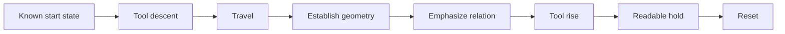
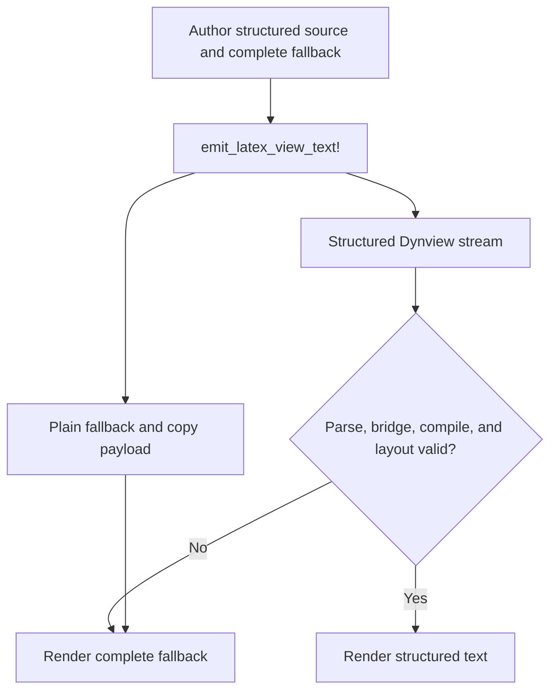

# Animations Style

This document captures the shared style conventions for Julia animations in
`src/julia/`, especially the Hilbert and Euclid content that uses the pen,
point, line, and plane primitives.

This is kind of a preliminary approach to the style language for the
animations. As further points arise with further animation work, this is
expected to mature.

## Table Of Contents

1. [Core Goals](#core-goals)
1. [Inspiration](#inspiration)
1. [Standard Palette](#standard-palette)
1. [Color Relationships](#color-relationships)
1. [Motion Conventions](#motion-conventions)
1. [Coordinate Space And Z Conventions](#coordinate-space-and-z-conventions)
1. [Isometric Projection And Right-Hand Rule](#isometric-projection-and-right-hand-rule)
1. [Draw Order And Layering Constraints](#draw-order-and-layering-constraints)
1. [Plane And Surface Treatment](#plane-and-surface-treatment)
1. [Point Labels](#point-labels)
1. [Reset Behavior](#reset-behavior)
1. [View Text Authoring](#view-text-authoring)
1. [Practical Review Check](#practical-review-check)

## Core Goals

- Keep motion readable.
- Make geometric relationships obvious.
- Use color to separate roles, not to decorate randomly.
- Prefer a small number of clear phases over busy simultaneous motion.

## Inspiration

Oliver Byrne's translation of Euclid's first 6 books is a good source of
inspiration for how to present geometry with clear color and layout choices,
but he is only a reference point. He is not a definitive style authority for
this project; we are not trying to reproduce his work, and in fact are using
the Heath translation in text.

## Standard Palette

Use these colors as the main animation palette unless a script has a specific,
documented reason to deviate:

| Color | Role | Guidance |
| --- | --- | --- |
| `steelblue` | Core geometry | Assign by relationship and scene balance. |
| `palevioletred1` | Core geometry | Contrast directly related simultaneous objects. |
| `khaki3` | Core geometry | Use as a peer of the other working colors. |
| `grey60` | Core geometry | Use as a peer, not only as a neutral fallback. |
| `plum1` | Point labels | Default label color. |
| `lightgreen` | Congruence | Standard relationship-highlight color. |
| `firebrick` | Absurdity | Use when intentionally drawing an absurd consequence. |

The first four colors form the shared working palette for lines, circles,
planes, and points. Assign them according to object relationships and the
balance of the complete scene, not fixed object types.

## Color Relationships

- Shapes that appear at the same time and have a direct geometric relationship
  SHOULD not share the same color.
- Intersecting or paired shapes SHOULD use different colors when the distinction
  helps the reader understand the construction.
- Choose among the four colors to balance the whole scene, not to lock a color
  to a fixed object type.
- Use `khaki3` and `grey60` the same way you use `steelblue` and
  `palevioletred1`: as part of the shared palette, assigned by relationship and
  composition.
- For order/between demonstrations that use drag passes, the drag color SHOULD
  match the center or emphasized point of that statement. Do not use an
  unrelated shared highlight color when a specific point is the focus.

## Motion Conventions

A typical construction follows this visual rhythm:



Omit phases that do not serve the construction, but preserve a readable start,
meaningful action, and legible finish.

- Start with pen descent when the animation is about drawing.
- Use `animate_pen_arcmove` for travel between distinct construction points.
- Use `animate_draw_point` when the point itself is being established.
- Use `animate_draw_line` when the line itself is being established.
- Use `animate_pen_tilt_and_drag` for surface or plane highlighting passes.
- End with pen rise and a short hold when the finished figure should remain on
  screen for a moment.
- Pen rise SHOULD begin from the final meaningful draw endpoint (or final
  emphasized point), not from an earlier anchor point.
- Prefer a double pass, once in each direction when using a dragging motion
  to highlight some shape or space. For example, when highlighting congruence
  between two lines or angles.

## Coordinate Space and Z Conventions

| Coordinate | Meaning | Standard use |
| --- | --- | --- |
| `x`, `y` | Normalized drawing surface | Use `[0.0, 1.0]` for ordinary surface work. |
| `z = 0.0` | Surface contact plane | Points, lines, circles, and descent endpoints. |
| `z > 0.0` | Height above surface | Tool lift/travel and intentional elevated geometry. |
| `z < 0.0` | Below surface | Avoid unless a script documents a specific need. |

Pen and compass rise phases should target a positive top height, commonly
around `1.4` in existing scripts. Plane primitives require an intentional
profile:

- Flat or on-surface demonstrations keep plane vertices at `z = 0.0`.
- Perspective or emphasis demonstrations may use positive `z` offsets for
  elevated vertices.
- Negative `z` is not the default way to communicate depth.

## Isometric Projection and Right-Hand Rule

The isometric helper in `src/view/core/isomath.odin` uses a right-handed
world-space convention.

What that means in practice:

- Hand-position rule used in this project: hold your **right hand palm up**,
  curl the last three fingers naturally, and keep your thumb and index finger
  perpendicular.
- In that pose, the **thumb points +X** and the **index finger points +Y**.
- Therefore, by the right-hand rule (`X × Y = Z`), **+Z is up**
  (height/elevation).
- Positive rotation follows the right-hand rule around each axis: curl your right-hand
  fingers in the rotation direction; your thumb points toward the positive axis.

Projection note:

- The projection maps world coordinates into screen coordinates, so signs in the
  formula account for screen-space Y increasing downward.
- In effect, increasing `coord.z` renders higher on screen, consistent with
  treating +Z as world up.

## Draw Order and Layering Constraints

The renderer is layered in a fixed order and animation scripts should be staged
with that order in mind.

Current frame order is:

| Order | Layer | Typical content |
| --- | --- | --- |
| 1 | Drawing surface | Persistent background surface. |
| 2 | Low cached geometry | Labels, points, lines, circles, and polygons. |
| 3 | Low particles | Effects behind tool shadows and high geometry. |
| 4 | Tool shadows | Pen and compass shadows. |
| 5 | Mid particles | Effects between shadows and active tools. |
| 6 | High cached tools | Active tool dots plus pen and compass strokes. |
| 7 | High particles | Effects above tools. |

Important implications:

- For low cached geometry, visual stacking follows definition/cache insertion
  order in practice. If two items overlap, "defined later draws later" is the
  default mental model.
- Pen/compass visuals are not depth-sorted against all geometry; they are drawn
  in a dedicated high layer near the end of the world pass.
- Particles are split across low/mid/high layers, so particle choice controls
  whether effects appear behind geometry, around tool shadows, or above tools.

Tool crossing guidance for 3D plane barriers:

- When a tool crosses a conceptual plane barrier, prefer short fade-out/fade-in
  transitions on the two sides of the crossing instead of trying to force a
  perfect geometric occlusion illusion.
- Prefer showing plane boundaries/structure with line-like representations
  (edges/dividers/traces) when possible, rather than relying only on a filled
  plane to communicate crossing depth.
- Keep these transitions brief and intentional so the viewer reads them as
  deliberate geometric staging, not a rendering artifact.

## Plane and Surface Treatment

- The app already provides a persistent drawing surface; do not simulate a full
  plane by drawing a large fake fill stroke unless the plane stroke itself is
  the geometric point being demonstrated.
- If a plane is conceptually important, label it (`α`, `β`, etc.) early and
  keep the label clearly away from the active construction cluster.
- Surface/plane drag strokes should be reserved for intentional emphasis passes,
  not as a default substitute for the existing surface.
- For square or plane primitives, use the vertex order documented in
  [ArchitectureSummary.md](ArchitectureSummary.md) so the face actually renders.

## Point Labels

- Use `plum1` for point labels by default.
- Keep labels offset enough that a visible gap remains between the label glyphs
  and the point marker; “barely offset” is a failure, not a preference.
- Keep labels clearly separated from both the point marker and nearby lines;
  avoid placements that visually sit on top of points or strokes.
- When placing a label, check the actual rendered composition, not just the raw
  coordinate offset. A small diagonal offset can still overlap once projected
  and rasterized.
- If a label is even partially touching the point marker in the rendered frame,
  move it farther. Do not accept point-label contact as good enough.
- The current renderer draws labels from the glyph origin at the supplied point;
  it does not center the glyph on that anchor. Treat this as a hard renderer
  fact and compensate with larger offsets than intuition suggests, especially
  for labels placed above a point.
- Labels should appear only after the related point has been established, unless
  the animation intentionally needs earlier annotation.
- For primed names in text/output, prefer ASCII apostrophe (`A'`) unless a
  specific UI path is confirmed to support Unicode prime consistently.
- Decorated labels (prime/hat/bar) should read as one symbol with the base
  letter: the decoration must be visually attached to the letter, not floating
  as an independent mark.

## Reset Behavior

- Reset phases should restore hidden or partially built geometry to a known
  start state.
- Keep the final composition visible briefly before resetting when the ending
  is meant to be read by the viewer.
- Avoid abrupt resets immediately after the last visible motion.

### Animation Program Contract

Every catalog-owned animation file is ordinary Julia source with a permanent
`AnimationId`. It must expose named `get_view_text`, `initialize`, `loop`, and `clean`
functions plus a direct `animation_entry(state_ptr, operation, dt)::Bool`. The entry
dispatches bridge-stable Enter, Tick, and Exit values; it is not generated by source
rewriting or replaced by a reflective hot-path adapter.

The final expression returns an `AnimationImplementation` whose UUID exactly matches
`AnimationId`. Loading occurs once per runtime generation, after which Odin invokes the
bound entry directly. Keep `get_view_text` named even though view updates are pushed:
`initialize` and changed-content paths pass that producer to `publish_view_update`.

## View Text Authoring

Animation view text has two coordinated outputs:

- A complete plain fallback string returned by `get_view_text(state_ptr)`.
- An optional structured Dynview stream containing styled prose, math, and
  embedded explanatory shapes.

The host uses structured output only when the complete stream is valid. A
parse, bridge, capacity, compile, or layout failure falls back to the returned
plain string. Structured output is therefore an enhancement, never the only
source of meaning.



### Preferred Authoring API

Use `EuclidLatex.emit_latex_view_text!` for complete animation view text. It:

- submits source and presentation metadata through the thin Julia facade;
- lets native Dynview classify and parse one complete semantic stream;
- installs the supplied fallback as the copy payload;
- returns the same fallback expected by `get_view_text`;
- preserves fallback safely when parsing, storage, staging, or publication fails.

```julia
const DefinitionLatexDocument = raw"""\textbf{Definition 1.}

A point \euclidpoint[color=plum1,size=1] is that which has no part.
The symbol $A_1$ identifies a particular point."""

const DefinitionFallback = """Definition 1.

A point is that which has no part. The symbol A_1 identifies a particular point."""

function get_view_text(state_ptr)
    EuclidLatex.emit_latex_view_text!(
        state_ptr, DefinitionLatexDocument, DefinitionFallback)
end
```

Use raw Julia strings for LaTeX source when practical. Keep source constants
stable across frames so generation-scoped exact-source interning can reuse semantics.

### Choosing Document Or Math Mode

| Mode | Use when | Supported content |
| --- | --- | --- |
| Document | Normal animation text surface | Prose, styles, inline/display math, breaks, shapes. |
| Math | Complete source is one expression | Scripts, fractions, radicals, operators, matrices. |

Document mode supports Unicode prose; `\textbf{...}`, `\textit{...}`, and
`\emph{...}`; inline math with `$...$` or `\(...\)`; display math with
`$$...$$` or `\[...\]`; blank-line paragraphs; forced breaks with `\\` or
`\newline`; and embedded Euclid shapes.

In math mode, prefer commands such as `\alpha`, `\leq`, and `\mathbb{R}`
over raw mathematical Unicode when the symbol is important to parser or style
behavior.

Use `\text{...}` or `\mathrm{...}` for upright words inside math. Document
styles such as `\textbf` do not replace math-mode text commands.

Use `\textcolor{color}{...}` for a short semantic emphasis in document prose.
Prefer the standard LaTeX names, `julia_blue`, `julia_red`, `julia_green`, or
`julia_purple`, or an established Colors.jl name already used by the scene.
Unknown names inherit the enclosing document color. Do not use text color as
the only carrier of meaning.

This is a bounded LaTeX-like language, not a TeX engine. Do not author macros,
packages, general environments, tables, lists, sections, or alignment layouts.
Consult [LaTeXSupport.md](LaTeXSupport.md) for the exact supported grammar.

### Text Hierarchy And Density

- Use bold for a short definition, proposition, axiom, or section lead.
- Use italic or emphasis for a local term, not an entire long paragraph.
- Prefer one or two readable paragraphs over manually aligned pseudo-columns.
- Use display math only when the expression deserves its own visual line.
- Keep inline math short enough to read within surrounding prose.
- Let Dynview wrap ordinary text; do not insert source newlines to control line
  width. A single document-source newline normalizes to a space.
- Use a blank source line for a semantic paragraph break.
- Avoid repeating the entire construction in prose while the animation already
  communicates it visually. Text should state the idea, relation, or conclusion.

### Embedded Euclid Shapes

Embedded Euclid shapes are inline explanatory symbols in view text. They are
not references to world-space points or shapes, do not move with animation
geometry, and do not prove that the corresponding world object exists.

Supported document commands and options are:

| Command | Options | Intended symbol |
| --- | --- | --- |
| `\euclidpoint` | `color`, `size` | Point marker. |
| `\euclidline` | `color`, `length`, `thickness` | Line or segment. |
| `\euclidcircle` | `color`, `size`, `thickness`, `filled` | Circle or filled locus marker. |
| `\euclidbox` | `color`, `width`, `height`, `thickness`, `filled` | Box or region marker. |

The shorthand option `filled` means `filled=true`. Dimensions must be finite
and positive, booleans must be `true` or `false`, and colors must resolve
through the bridge color vocabulary.

```julia
const ConstructionLatexDocument = raw"""The point
\euclidpoint[color=plum1,size=1] marks $A$. Draw
\euclidline[color=steelblue,length=4,thickness=2] from $A$ to $B$, then use
\euclidcircle[color=khaki3,size=2,thickness=1] to show the locus."""
```

Authoring rules for embedded shapes:

- Use a shape when its silhouette or color carries immediate semantic meaning.
- Match its color to the corresponding role in the animated construction.
- Keep the standard animation palette; do not introduce decorative colors in
  text that have no matching role in the scene.
- Place the shape next to the noun or relation it explains.
- Keep dimensions modest so the atom participates in the line rather than
  dominating it.
- Use filled circles and boxes only when fill itself distinguishes the object.
- Do not reproduce a full diagram in prose from many inline atoms.
- Do not use an embedded shape as the only representation of required meaning.
  The fallback must name or describe it in words.

The shape command belongs in document mode. For a custom low-level Dynview
stream, use the corresponding `dynview_inline_*` bridge APIs.

### Fallback And Copy Semantics

Fallback text is authored content, not generated error text. It must remain
complete and readable when structured output is unavailable.

- Preserve all definitions, claims, labels, and mathematical conclusions.
- Replace embedded shapes with concise nouns or descriptions.
- Represent important formulas with readable Unicode or plain notation.
- Preserve paragraph structure where it affects comprehension.
- Never expose raw LaTeX commands in the fallback.
- Review both the structured rendering and plain fallback before accepting an
  animation.

`emit_latex_view_text!` uses the supplied fallback as the copy payload. Copying
structured text should therefore yield coherent plain content rather than a
sequence of visual implementation fragments.

Document mode fails closed. Unsupported commands, malformed style groups,
unclosed math delimiters, empty math fragments, or invalid shape options abort
the structured stream instead of displaying a partial document.

### Specialized LaTeX APIs

| API | Use |
| --- | --- |
| `emit_latex_view_text!` | Complete document/math view text with authored fallback. |
| `replay_emit_math_block!` | Insert one source-based expression into an open Dynview block. |
| Direct Dynview bridge calls | Last resort for composition the high-level APIs cannot express. |

`replay_emit_math_block!` returns `false` on bridge failure.

Do not manually parse LaTeX or approximate structured math with spaced text.

### Low-Level Dynview Escape Hatch

Use direct `OdinJuliaBridge` Dynview calls only when the high-level document and
math APIs cannot express the required composition. Typical low-level content
calls are:

- `dynview_text_run(state_ptr, text, style_id)`;
- `dynview_line_break(state_ptr)`;
- `dynview_copyable_text_run(state_ptr, copy_text)`;
- `dynview_inline_line(state_ptr, length_cols, stroke_px, style_id)`;
- `dynview_inline_box(state_ptr, width_cols, height_cols, stroke_px, style_id)`;
- `dynview_inline_circle(state_ptr, radius_cols, stroke_px, style_id)`.

A manual stream must strictly follow this lifecycle:

1. `dynview_reset_stream(state_ptr)`.
1. `dynview_begin_block(state_ptr, block_kind, block_id)`.
1. Emit a complete copy payload and visible content.
1. `dynview_end_block(state_ptr)`.

Every bridge call returns a `BRIDGE_STATUS_*` value. Stop on the first non-OK
status and return the complete fallback. Never continue writing a partially
failed stream.

Low-level atoms use layout-relative column or pixel units, not world-space
coordinates. They are text-layout content and must follow the same semantic,
color, density, and fallback rules as document-mode shapes.

## Practical Review Check

Before adding a new animation, ask:

1. What is the main geometric idea?
1. Which object should visually dominate?
1. Are any same-time shapes accidentally sharing a color?
1. Does the motion sequence read as construction instead of teleportation?
1. Does view text state the geometric idea without narrating every visible action?
1. Does each embedded shape match a meaningful object or role in the scene?
1. Is every formula written with supported LaTeX rather than approximate spacing?
1. Does the plain fallback preserve every claim represented by styles, math, or shapes?
1. Have both structured Dynview output and fallback text been reviewed?
