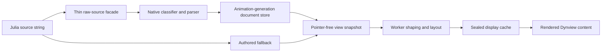
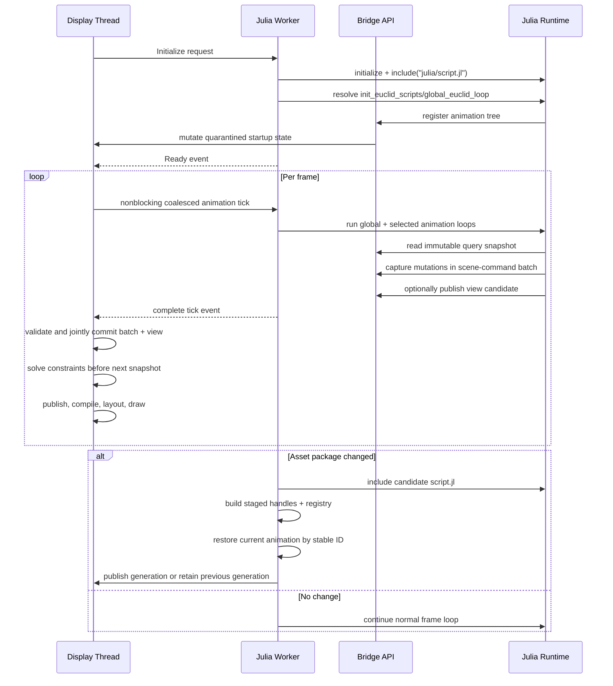

# Euclid Architecture Summary

## Table Of Contents

1. [What This Project Is](#what-this-project-is)
1. [Where To Start Reading](#where-to-start-reading)
1. [Module Map (Odin + Julia)](#module-map-odin--julia)
1. [Scratchpad Architecture (Interactive Runtime Surface)](#scratchpad-architecture-interactive-runtime-surface)
1. [Dynview Text Engine (Hybrid-Immediate Rendering)](#dynview-text-engine-hybrid-immediate-rendering)
1. [Dynamic LaTeX Pipeline (Native Parse And Layout)](#dynamic-latex-pipeline-native-parse-and-layout)
1. [Odin-Julia Bridge: How the Boundary Works](#odin-julia-bridge-how-the-boundary-works)
1. [Threading Strategy](#threading-strategy)
1. [Testing Strategy](#testing-strategy)
1. [Allocation Strategy: Init-First with Explicit Exceptions](#allocation-strategy-init-first-with-explicit-exceptions)
1. [Build and Packaging Model](#build-and-packaging-model)
1. [Practical Contributor Guide](#practical-contributor-guide)
1. [Key Architecture Takeaways](#key-architecture-takeaways)

## What This Project Is

Euclid is a desktop visualization app for geometric constructions and proofs.
The overall structure includes 2 programming languages, Odin and Julia.

- **Odin** code provides the application shell, rendering loop, simulation data model,
    memory ownership, and bridge exports. It owns long-lived application state
  (`Euclid_General_State`), rendering, UI, and systems (shapes + particles +
  gif capture).
- **Julia** code provides animation/content logic loaded from scripts at runtime. It
    registers an animation tree and drives per-animation behavior by calling exported
    Odin-Julia Bridge functions.

A useful mental model:

- Odin is the **engine and host process**.
- Julia is the **animation/content runtime** running inside that host.

---

## Where To Start Reading

If you are new, read in this order:

1. Host lifecycle path (`src/main.odin`, `src/view/view.odin`).
1. Host/runtime boundary (`src/bridge/abi.odin`, `src/bridge/abi-*.odin`,
   `src/bridge/bootstrap.odin`, `src/bridge/animations.odin`,
   `src/bridge/scene.odin`, `src/bridge/scratchpad.odin`,
  `src/bridge/dynview_native_tex.odin`, `src/julia/odin-julia-bridge.jl`).
1. Dynview runtime (`src/dynview/dynview.odin`, `src/dynview/compile/compile.odin`,
   `src/dynview/core/`, `src/dynview/math/`, `src/dynview/layout/`).
1. Julia runtime entry (`src/julia/script.jl`).
1. Then continue by module using the maps below, touching only each module's
   highlighted files first.

---

## Module Map (Odin + Julia)

| Section | Module | Purpose | Key files |
| --- | --- | --- | --- |
| **Odin** | Application Lifecycle | Process entry and startup/shutdown sequencing. | `src/main.odin` |
| **Odin** | Core Definitions | Canonical runtime data shapes and capacity constants. | `src/core/core.odin` |
| **Odin** | Rendering and UI | Frame loop wiring, world rendering, panel rendering, and interaction routing. | `src/view/view.odin`, `src/view/elements.odin`, `src/view/core/view_core.odin`, `src/view/core/isomath.odin`, `src/view/ui/ui.odin` |
| **Odin** | Font Cache | Required JuliaMono/NewCM residency, MATH-table admission, demand-paged glyphs, asynchronous CPU preparation, display-thread publication, and source reload monitoring. | `src/view/font/font.odin`, `src/view/font/prepare.odin`, `src/view/font/async.odin`, `src/view/font/finalize.odin`, `src/view/font/watch.odin` |
| **Odin** | Dynview Runtime | Bounded TeX parsing, generation-scoped semantic documents, text/math compilation, layout planning, draw-ready caches, and a generation-tagged worker-owned NewCM shaping capability. | `src/dynview/dynview.odin`, `src/dynview/parse/`, `src/dynview/core/`, `src/dynview/compile/compile.odin`, `src/dynview/math/`, `src/dynview/layout/`, `src/dynview/tracking.odin` |
| **Odin** | Geometry Kernel | Shapes, constraints, and system evolution/integration rules. | `src/shapes/shapes.odin`, `src/shapes/constraints.odin`, `src/shapes/system.odin` |
| **Odin** | Semantic Evidence | Typed event schemas, producer-local rings, session policy, observations, scenarios, captures, exports, and artifacts. | `src/evidence/`, `src/view/scenario_runtime.odin`, `src/view/runtime_session.odin` |
| **Odin** | Operational Diagnostics | Synchronized optional file logging for lifecycle, degradation, and failure investigation. | `src/diagnostics/`, `src/main.odin` |
| **Odin** | Bridge and Embedding | Host-side Julia lifecycle, strict bridge ABI, native TeX ingestion, and snapshot staging. | `src/bridge/abi.odin`, `src/bridge/abi-*.odin`, `src/bridge/bootstrap.odin`, `src/bridge/animations.odin`, `src/bridge/scene.odin`, `src/bridge/scratchpad.odin`, `src/bridge/dynview_native_tex.odin`, `src/bridge/dynview_runtime.odin` |
| **Odin** | Julia Interop Dependency | External Odin<->Julia interop package consumed by bridge embedding code. | `src/julialib/julialib.odin` (git submodule) |
| **Odin** | Assets and IO | Asset package extraction/path resolution and GIF output internals. | `src/files/files.odin`, `src/files/gif_encode.odin` |
| **Odin** | Particles | Multi-layer particle systems and visual effects. | `src/particles/particles.odin` |
| **---** | **--- Julia Modules ---** | **---** | **---** |
| **Julia** | Runtime Bootstrap | Script loading, animation registration, and global frame dispatch. | `src/julia/script.jl` |
| **Julia** | Bridge Wrapper | Ergonomic Julia wrappers around bridge exports. | `src/julia/odin-julia-bridge.jl` |
| **Julia** | Shared Animation Utilities | Reusable animation and geometry helper routines. | `src/julia/animations.jl`, `src/julia/geometry.jl`, `src/julia/nullanimation.jl` |
| **Julia** | Interactive Runtime | Scratchpad/REPL session lifecycle, queueing, and evaluation flow. | `src/julia/scratchpad.jl`, `src/julia/euclidrepl.jl` |
| **Julia** | LaTeX Facade | Submits source, fallback text, and presentation metadata to native Dynview APIs. | `src/julia/latex.jl`, `src/julia/latex/facade.jl` |
| **Julia** | Content Modules | Domain content roots and leaf animation definitions. | `src/julia/elements/elements.jl`, `src/julia/proclus/proclus.jl`, `src/julia/hilbert/hilbert.jl` |

Dynview production callers import the child package that owns each symbol. Root
`src/dynview` owns only subsystem enablement and invalidation tracking; it does not
forward child APIs. `dynview/core` owns shared primitives, `dynview/math` owns intrinsic
formula measurement and shaping, `dynview/layout` places measured content into document
and grid rows, and `dynview/compile` orchestrates derived-cache rebuilds. Display-thread
drawing and Raylib resource ownership remain in `src/view/ui/dynview`.

One invalidated derived-cache transaction runs in dependency order:

1. Clear partial views, shaped records, and the worker-owned cache arena.
1. Copy immutable semantic math records into mutable measurement storage.
1. Compile and seal plain text, copy payloads, and copy blocks.
1. Shape and seal intrinsic math records.
1. Rebuild and seal document layout records.
1. Publish revision metadata, clear invalidation, and mark the cache valid.

Content-module contract:

- Startup registers the complete metadata catalog without evaluating path-backed programs.
- Every catalog item has a permanent UUID and a generation-local implementation path.
- Animation files provide named `get_view_text`, `initialize`, `loop`, `clean`, and a
  direct `animation_entry` that dispatches bridge-stable lifecycle operations.
- First activation loads and validates the selected UUID, then Odin caches its entry on
  that generation's registry node. Normal ticks call the cached entry directly.
- Bridge calls mutate host state while Julia controls pedagogical flow.

The Julia owner worker roots one stable `EuclidRuntimeHost` for its initialized
lifetime. The host retains the borrowed, lifetime-stable Odin state pointer, owns
persistent Scratchpad session and extension state, and roots its committed
`EuclidRuntimeGeneration`. Each generation owns a fresh anonymous content module,
catalog, load cache, and implementation roots. Generation commits preserve the host's
Scratchpad state. Odin-held Julia pointers are borrowed and never establish GC
ownership; Julia never frees the native state pointer.

Reload constructs and roots a candidate generation locally, registers it against the
inactive Odin interface, restores the active UUID, validates Enter, commits the host's
generation with one assignment, and only then publishes the interface. Failure restores
the old interface, forces full Julia GC, and restarts the old animation before reporting
rollback. Candidate state and pointers never enter the committed generation on failure.

Operational diagnostics are optional human-readable records written through the
synchronized logger configured by `--diagnostics=PATH`. They describe process and
subsystem lifecycle, degradation, and failures, but never determine application
behavior. Typed semantic evidence remains authoritative for scenarios and behavioral
verification, while `--profile=spall:PATH` records timing rather than diagnostics.

---

## Scratchpad Architecture (Interactive Runtime Surface)

Scratchpad is an interactive runtime surface, not a normal deterministic
animation. It is mounted in the animation tree as `"Scratchpad"`, but behaves
like an embedded REPL control plane.

See [ScratchpadArchitecture.md](ScratchpadArchitecture.md) for the detailed
Odin/Julia ownership, communication, evaluation, rendering, and lifecycle model.

### Core Architecture

- Odin owns UI input capture, text panel interaction, and buffer/cursor state.
- Odin owns Julia/Help editor mode transitions and live prompt presentation.
- Julia owns command parsing/evaluation, command history, and output stream
  generation; Help-mode queries delegate to Julia's native `REPL.helpmode`.
- Communication crosses the bridge through explicit scratchpad entrypoints.
- Async requests, queued input, and history entries carry input mode explicitly
  so delayed work and history navigation cannot infer the wrong prompt mode.

### Frame Model And Lifecycle

- Input is only captured when the Scratchpad node is the active selection.
- Enter submission is parse-aware:
  - incomplete parse appends newline
  - complete parse enqueues command
- Julia processes at most one queued command per frame, then runs optional
  per-frame hooks.
- Sessions are isolated via fresh runtime modules and support explicit
  reset/clean transitions without terminating the host.

### Safety, Reliability, And Limits

- Input is policy-filtered before eval.
- Parse/eval/hook failures are surfaced as user-visible output, not host
  crashes.
- Repeated failing hooks auto-disable to prevent recurring frame-time spam.
- Queue/history/output are bounded with retention caps and overflow behavior.
- Runtime diagnostics are exposed through `:stats` counters.

---

## Dynview Text Engine (Hybrid-Immediate Rendering)

Dynview snapshots contain two parallel surfaces:

- Plain fallback text (`get_view_text`) for guaranteed readability.
- Structured command stream for styled text, inline atoms, and recursive math blocks.

Snapshot and display flow:

1. A named Julia producer emits fallback text and dynview commands only inside
  its owning lifecycle or animation-tick transaction.
1. Julia explicitly calls `publish_view_update`; Odin never polls
  `get_view_text` or stores it as a callback.
1. The worker publishes a complete animation-tagged semantic snapshot.
1. Odin validates and installs immutable populated views at a frame boundary.
1. Odin emits required `Dynview_Published` evidence after animation identity
  validation and display publication succeed.
1. A snapshot stamped by a completed Scratchpad evaluation additionally emits
  required `Scratchpad_Completed` evidence correlated to the original runtime request.
1. Odin compiles command buffers to cached plain/copy/layout state.
1. If compile/layout is valid, Odin renders dynview output.
1. If any stream stage fails, Odin falls back to plain text with no host crash.

### Architectural Contract

| Ownership | Odin | Julia |
| --- | --- | --- |
| Runtime/UI state | Owns front buffer/cache/layout/draw and copy-hit targets | Reads nothing directly |
| Text intent | Validates and consumes immutable snapshots | Produces fallback + optional stream in worker staging |
| Failure semantics | Invalid stream marks cache invalid and falls back | Must treat non-OK bridge status as stop-and-fallback |

---

## Dynamic LaTeX Pipeline (Native Parse And Layout)

Dynamic LaTeX support is now a first-class dynview path, not a special case.
`src/julia/latex.jl` exposes a stable authoring facade. It forwards source,
authored fallback, and small presentation metadata through raw-source bridge
requests. Dynview owns classification, bounded recursive-descent parsing,
normalization, semantic storage, snapshot copying, measurement, and layout.

### Native Ingestion

| Stage | Implementation | Core functions | Result |
| --- | --- | --- | --- |
| Submit | `src/julia/latex/facade.jl` | `emit_latex_view_text!`, `replay_emit_math_block!` | Raw source plus presentation metadata |
| Classify | `src/dynview/parse/document_grammar.odin` | `tex_classify_source_mode`, `tex_document_whole_math` | Document or math mode and root style |
| Parse/lower | `src/dynview/parse/` | bounded cursor, document grammar, math grammar, semantic builders | Font-independent math programs plus document blocks and inlines |
| Intern | `src/dynview/core/document_store.odin` | `document_store_intern`, `document_store_resolve` | Immutable generation-scoped semantic document |
| Stage | `src/bridge/dynview_native_tex.odin` | native document/math import | Pointer-free semantic records in worker staging |
| Publish | `src/bridge/runtime_service.odin` | snapshot validation and publication | Immutable slot-owned semantic snapshot |

Native compatibility tests cover nested scripts, accents,
radicals, fractions, stretch delimiters, matrix environments, declared operator
names, and grouped mathematical alphabets.

Document grammar revision 29 preserves paragraph and display blocks with bounded
inline text, spacing, math, shape, penalty, forced-break, and technical display-row
records. Space records
retain source byte spans and carry one canonical space byte for native shaping. These
records otherwise use indices and values only. They are the sole stored document
representation. A parse or capacity failure publishes no semantic blocks or inlines.

### End-To-End Flow

### Runtime Boundaries For LaTeX

- Julia side:
  - `emit_latex_view_text!` sends complete source plus caller-authored fallback.
  - `replay_emit_math_block!` sends one source fragment plus text, math,
    mathematical-alphabet, and root-style metadata.
  - Julia does not classify, parse, normalize, cache, or encode TeX semantics.
- Odin side:
  - The parser applies explicit source, work, depth, command, node, span, run,
    and table limits before publishing semantics.
  - The document store keys exact source bytes with grammar, semantic profile,
    parse mode, and root style. Repeated source within one animation generation
    resolves the same immutable document.
  - Bridge staging checkpoints cover text, commands, math records, document bytes,
    blocks, and inlines. Any parse, store, range, or capacity failure restores the
    complete fragment and preserves the authored fallback.
  - Native document import copies exact source and semantic text into dedicated
    staging bytes. It rebases block children, source/text spans, and inline math
    programs before the animation-lifetime document handle leaves the owner path.
  - Snapshots seal document bytes, descriptors, blocks, and inlines in slot-owned
    arenas. Publication validates every alias, enum, span, child range, and math
    program reference. Document-store handles and animation-arena pointers never
    cross into display-owned state.
  - `src/dynview/math/programs.odin` measures script/large-op/fraction/radical/matrix
    structures before draw. It owns display, text, script, and script-script
    transitions, including cramped child state.
  - The resident font capability captures all OpenType MATH constants as one
    immutable font-generation snapshot. Worker shaping and derived layout cache
    publication reject stale generations and publish constants transactionally
    with shaped records.
  - Required NewCM seed storage is fixed at 512 scalars; the current 417-scalar
    seed includes all advertised alphabet families. Font tests query every
    advertised alphabet scalar through HarfBuzz before accepting the face.
  - Worker-only HarfBuzz queries publish bounded vertical variants and glyph
    assemblies after shaped-cache sealing. Layout selects and seals exact radical
    and delimiter constructions; display drawing resolves every selected part
    through bounded glyph-page demand and uses synthetic geometry only when font
    construction data is rejected or not yet resident.

Practical effect: Julia authors source and fallback policy; native Dynview owns
the complete semantic and physical realization pipeline.

---

## Odin-Julia Bridge: How the Boundary Works

### Basic Flow

### Ownership And Rules

- Odin owns application state, memory, rendering, and final frame orchestration.
- Julia owns animation/content logic and drives changes only through bridge APIs.
- Core owns the typed runtime-service, snapshot, scene-command, and simulation
  executor data shapes referenced by `Euclid_General_State`. Bridge and view
  modules own the behavior that operates on those structures.
- The bridge is a strict API boundary. Odin exports and Julia wrappers must
  remain symmetric, and failures must be surfaced without partially mutating
  canonical host state.
- Runtime state uses concrete subsystem pointers. Do not erase subsystem types
  behind `rawptr` fields in `Euclid_General_State`.

---

## Threading Strategy

Euclid uses one display thread, one persistent Julia owner thread, and a
persistent simulation worker pool. These roles have separate ownership and
synchronization rules; no subsystem may treat the workers as interchangeable.

### Thread Roles

- The **display thread** owns window events, raylib rendering, UI state,
  canonical scene state, fixed-step orchestration, and final publication of
  worker results.
- The **Julia owner thread** exclusively owns Julia initialization, every Julia
  C API operation, callback handles, script reload, and Julia shutdown. Bridge
  tasks that call Julia must assert this owner identity.
- The **simulation pool** is the bounded `src/taskpool` service. It reserves two
  logical processors for display and Julia work, owns fixed TLSF-backed task and
  queue storage, and reuses persistent workers for independent fixed-step systems
  and per-frame cache preparation. It also prepares requested font variants on
  CPU workers. Tasks must not call Julia or thread-affine raylib window, audio,
  or rendering APIs.

Pool handles are generational, joined exactly once, and may receive cooperative
cancellation requests before join. Cancellation never releases payload ownership or
removes queued backend work: a task observes its token only at bounded checkpoints,
and the submitting owner still joins before reusing payload or allocator storage.
Cancellation requested before join is the authoritative terminal result. Deterministic
fences rank failure above cancellation above success; mandatory simulation and frame
preparation tasks are not cancelled.

### Julia Owner Thread

The display and Julia threads communicate through bounded typed channels and
service-owned fixed slots. Scratchpad work uses copied request/reply slots,
view output uses complete semantic snapshots, and animation callbacks read
immutable query snapshots while producing transactional scene-command batches.
The display validates and publishes completed results at explicit frame or
fixed-step boundaries.

Selection, reset, and reload use a narrow synchronous lifecycle barrier after
asynchronous animation work quiesces. Julia initialization, callback execution,
reload, exception inspection, and shutdown always remain on the owner thread.

See [JuliaThreadArchitecture.md](JuliaThreadArchitecture.md) for the complete
request/event model, slot lifecycles, backpressure, publication rules, reload
state machine, diagnostics, shutdown policy, and current constraints.

### Fixed-Step Simulation

The canonical fixed-step operation is `run_deterministic_fixed_step`. It preserves this
ordering:

1. Publish an available Julia animation batch.
1. Schedule the next nonblocking Julia animation tick.
1. Submit particle update and constraint solve tasks to the simulation pool.
1. Join the complete simulation batch.
1. Advance display-owned `fixed_step` and deterministic `simulation_time`.
1. Emit the post-join semantic trace summary.

The interactive loop calls `run_windowed_fixed_step`, which layers GIF capture
state on top of that deterministic step. GIF behavior is presentation-side
policy and is not part of the core semantic step boundary.

Particle tasks exclusively mutate `Particle_System`; constraint tasks exclusively
mutate `Shapes_Point_System`. Their payloads are persistent executor fields.
Each batch uses a deterministic fence allocated from the pool's fixed backing
region and released at join. While waiting, the display owner may execute queued
pool work itself. It does not continue past the fence until both tasks complete,
so canonical constraints settle worker-commanded geometry before any dependent
capture or rendering work.

### Per-Frame Preparation

After all fixed steps complete, the display thread opens a second pool window:

1. Compute and publish the frame's UI regions and exact text-panel geometry.
1. Track Dynview panel, font, and style inputs to determine whether its cache is
  invalidated.
1. Submit shape draw-cache construction every frame.
1. Submit Dynview compile and layout construction only when invalidated.
1. Join every submitted task before beginning raylib drawing.

Shape preparation reads settled point state and exclusively writes
`Shapes_Point_System.draw_cache`. Dynview preparation exclusively writes the
Dynview compile and layout caches. Dynview owns one growing display-cache arena with a
1 MiB initial reservation. An invalidated Dynview task enters worker-mutable ownership,
resets the arena, and builds derived views. Failure clears partial derived views and
retains plain fallback. Task completion returns display-readable ownership, and the
fence joins before panel drawing or copy access.

Bounded builders publish compiled plain-text and copy-payload slices only after both
complete streams seal within the existing text limit. These display-readable aliases
remain valid until the next cache-arena reset; rejection clears them before fallback.
Copy blocks seal in the same compile transaction, preserving source order and payload
spans under the command-count limit. After the worker fence, the display thread rebuilds
panel- and scroll-dependent hit targets in a reusable bounded builder. Repeated frames
reuse its arena capacity; each successful refresh publishes only the populated prefix,
and rejection publishes no targets. Bounded line and item builders retain the existing
scalar counts and indexes while remaining worker-mutable during grid placement and
aggregate metric calculation, then both seal before `layout_is_valid` publishes
populated slices. Empty content publishes one canonical line; overflow or invalid
layout publishes neither family. Bounded shaped-run
and glyph builders retain their logical maxima and publish populated arena slices only
after generation, source, glyph, and command-site spans all validate. Rejection
publishes no shaped records and leaves all command-site indices on their unshaped
fallback sentinel. The tasks may run concurrently because their ownership does not
overlap. Shutdown clears arena-backed aliases and destroys the arena only after the pool
is quiescent.

### Font Cache

`Euclid_General_State.font_cache` owns every resident JuliaMono GPU font and its
resolved source paths. Each resident generation pairs a 96-codepoint printable-ASCII
and U+FFFD compatibility seed with generation-owned HarfBuzz handles, an exact-size
glyph-state table indexed by face glyph ID, and up to 32 immutable demand-loaded
texture pages. Regular loads synchronously as the permanent fallback. Other weights
and italic variants are requested on demand. Seed and page preparation are serialized
through the shared taskpool using one reusable virtual arena and finalized on the
display thread. Frame service polls without waiting and publishes only
current-generation results. When a newer generation supersedes accepted work for the
same font, the display owner requests cooperative cancellation and continues polling
until the task is terminal. Preparation checks cancellation between allocation,
metrics, packing, and glyph-rasterization work, clears partial result metadata, and
retains arena ownership until the task is joined. Cancelled page work restores queued
glyph demand for later preparation.

The resident font's cmap defines Unicode support; Euclid no longer maintains a broad
Unicode allowlist. Shaped text uses HarfBuzz output glyph IDs directly. Unshaped
geometry labels and dynview math map each Unicode scalar through the same generation's
HarfBuzz font, then resolve the resulting glyph ID through the page table. Pending,
unsupported, and capacity-blocked direct glyphs display the seed's U+FFFD replacement.
Demand state lives directly in the exact-size glyph table, avoiding a growing set.

Each page task admits genuine demand first, then deterministically fills unused batch
capacity with missing face glyph IDs. Ordinary pages therefore contain 256 glyphs,
making the append-only generation ceiling up to 8192 paged glyphs plus the seed.
Published pages are never repacked or evicted. Demand beyond the reserved 32-page
capacity becomes terminal for that generation and continues to display U+FFFD until
source reload creates a new generation. Generation-local counters record page
publication, prefetch, pending codepoint lookup, unsupported lookup, and first capacity
rejection without retaining source text.

Shaping uses one reusable native HarfBuzz buffer per resident generation and one
display-owned 4096-glyph workspace. Both are allocated during initialization or
font publication, never per frame. A run is completely validated before drawing;
workspace overflow, invalid glyph/cluster data, non-horizontal metrics, or pending
glyph pages fall back atomically to the existing unshaped renderer. Shaped drawing
uses a second resolver that normalizes seed and page texture records rather than
indexing `rl.Font` directly. Hot reload publishes the seed, exact-size metadata, and
shaper together, preserving the prior generation when any candidate component fails.
All old pages are retired with that prior generation.

Semantic prose shaping borrows those resident JuliaMono shapers through an
exact-generation worker capability. Each requested variant resolves to either its own
resident face or Regular, and the capability records both the requested and effective
key so fallback publication cannot be confused with a later variant publication at the
same generation number. The display thread tracks all 14 effective key/generation
identities and invalidates Dynview when any identity changes. The simulation executor
owns one fixed-capacity prose glyph workspace for its complete lifetime; it is created
once before the worker pool starts and released after the pool joins.

During invalidated compilation, every semantic text and space inline is shaped before
math measurement and document layout. Bounded arena builders retain source-relative
clusters, advances, offsets, exact face identity, and aggregate width and ink metrics.
They publish `Dynview_Document_Shaped_Run` and glyph slices only after all inline,
source, glyph, and generation spans validate. Failure clears both slices rather than
publishing a partial cache.

Semantic document compilation skips command-layout construction. It consumes sealed
prose runs and recursively measured NewCM programs directly, lowering semantic inlines
to bounded boxes, glue, penalties, and forced breaks before selecting measured line
breaks. Unbreakable sequences remain intact and become explicit overfull lines when
necessary. Math and Euclid shapes remain atomic boxes whose dimensions come from the
measured math programs and shape payloads. Standalone math and unrelated plain command
streams retain the command-layout path.

The resulting node, block, line, item, and copy-target slices publish as one
arena-backed authoritative cache. Items retain semantic source and canonical text spans;
prose copy targets derive their horizontal positions and UTF-8 ranges from sealed
HarfBuzz clusters, while math and shape targets retain their source spans. Missing
prose measurements or any lowering or capacity failure clears every document-layout
slice. Complete failure returns the view to its authored plain-text fallback.

The document cache places composed lines in exact pixels with TeX-inspired
previous-depth leading. Each next baseline uses the configured baseline skip when the
measured depth and ascent permit it, otherwise it falls back to a non-overlapping line
skip. Paragraph and display glue apply between blocks, reset at semantic document
boundaries, and display lines center within the measured panel width unless an explicit
alignment overrides them. Final line origins propagate to items and cluster-derived
copy rectangles without reconstructing rows or columns.

Only a completed block crosses back into outer-grid geometry. Its exact extent,
including resolved leading glue, rounds outward from the current row boundary; the
layout cache records the reserved row range and trailing padding separately from the
exact ink bounds. Semantic drawing and scrolling consume these sealed positions, while
the grid package owns only generic extent rounding and contains no document semantics.
Copy icons use the same semantic block bounds and retain the authored fallback payload.

Dynview owns a separate generation-tagged NewCM buffer on its preparation worker.
Julia marks normal math runs as italic variables or upright symbols using existing
style IDs. Before NewCM shaping, Odin strictly decodes the original run into bounded
worker-owned temporary bytes and projects only eligible Latin and lowercase Greek
variables to mathematical italic Unicode. Original command, fallback, and copy bytes
are never rewritten by projection.

Ordinary UI text, fallback prose, top-level dynview `Text_Run` items, transcripts,
and scratchpad input are shape-eligible. Scratchpad runs split at the cursor and the
covered UTF-8 character is drawn unshaped. During invalidated Dynview preparation,
eligible math-command sites are shaped once and measured from cached NewCM advances,
extents, italic correction, and top-accent attachment. Recursive scripts, fractions,
delimiters, radicals, accents, matrices, and large operators inherit those dimensions;
top-level prose and outer-grid policy remain unchanged. Recursive draw items retain the
originating math-command index. The display thread resolves the exact sealed
command/site glyph slice through its matching resident `Math_Regular` generation,
preflights complete residency, and draws cached offsets and advances without reshaping.
Script, radical-index, and large-operator placement reuse the measurement metric
scaler. Stale generations, invalid spans, and pending glyphs reject the complete site
before the existing whole-run fallback draws; copy bytes and non-math paths are
unchanged.

Julia owns authored source, fallback content, and presentation metadata. Raw-source
requests cross as mirrored by-value structs; recursive semantic records do not cross the
language boundary. Native Dynview derives atom and glue classes, recursive structure,
delimiter and accent kinds, operator policy, and typed table descriptors. It validates
every source span, enum, descriptor index, and bounded tree relation before snapshot
publication; invalid input publishes no partial document or math program.

Odin alone owns font-sensitive decisions. A worker-borrowed Math_Regular capability
provides one immutable generation-stamped constants snapshot plus bounded glyph
metrics, corner-kern tables, vertical and horizontal variants, and assemblies. Cache
rebuild accepts those records only when the shaping service and every result match the
active generation. Layout selects variants, solves assemblies, applies final-height
math kern, and seals child baselines, x positions, rules, and construction part
offsets into layout items. Drawing consumes those records without querying HarfBuzz or
independently repeating a typographic decision.

Native-geometry validity and font-generation fields on each sealed item make fallback
use explicit. Missing, stale, malformed, over-capacity, or pending native data leaves
the corresponding validity field unset and routes the complete structure through its
bounded synthetic fallback. Julia-emitted ratios remain only as compatibility inputs
to those fallback paths; successful MATH layout does not consume them. Font-page
resolution separately records fallback demand in generation-local cache telemetry.

Source changes are polled at a bounded cadence and debounced before replacement.
Shutdown rejects new font requests, requests cancellation of accepted font work,
joins that work before destroying the taskpool, unloads seed and page textures while
the graphics context is live, releases exact-size generation metadata, destroys
HarfBuzz handles, and finally releases the preparation arena.

### Lifecycle And Failure Rules

- Normal Julia work begins only after startup registration publishes `Ready`.
- Selection, reset, and reload invalidate stale asynchronous results; failed
  reloads retain the previous valid interface generation.
- Julia shutdown completes on its owner thread before service destruction.
  The simulation pool is also joined before canonical state is freed.

---

## Testing Strategy

Euclid's testing foundation is the ordinary unit and module test suite. Those
tests are the first line of defense for geometry, dynview, files, particles,
bridge behavior, and runtime invariants before any higher-level harness or trace
system is involved.

On top of that baseline, Euclid now has a dedicated testing architecture built
around semantic tracing, deterministic fixed-step execution, and a headless
runtime harness. The interactive app and the harness share the same runtime
session and deterministic step boundary, while test-only orchestration remains
outside the production control surface.

See [TestingStrategy.md](TestingStrategy.md) for the full testing model,
including trace ownership, checkpoint boundaries, harness usage, failure policy,
and current coverage gaps.

---

## Allocation Strategy: Init-First with Explicit Exceptions

This policy is strict by design.

### Non-Negotiable Rules

- Default rule: no growing host allocations in steady per-frame paths.
- Long-lived host state must be allocated at startup and reused.
- When a maximum size is known, preallocate and mutate in place.
- Julia interface generations use two inline host-state slots. Reload prepares
  the inactive slot and never allocates or frees an interface struct.
- Fixed-step and per-frame task payloads and pool completion storage are
  allocated at startup and reused for every batch.
- New per-frame heap growth requires explicit justification in review.

### Allowed Exceptions

1. Frame-scoped scratch memory from the temp allocator.
   - Example: temporary UI/text conversion buffers.
   - Requirement: reclaimed by frame reset (`free_all(context.temp_allocator)`).
1. Julia runtime GC-managed allocations.
   - Julia owns script/runtime objects.
   - Odin owns host state and must stay deterministic on the host side.
1. Dedicated virtual arenas for lifecycle-scoped subsystems.
   - Examples: GIF encoder working memory and Julia animation registries.
   - Requirement: `arena_free_all` on logical reset/reload and `arena_destroy`
    on subsystem/application teardown.
1. Event-driven allocations outside steady frame loops.
   - Current approved cases are intentionally narrow:
      1. Final contiguous GIF output buffer returned by encoder end with
        documented allocation.
      1. Asset-unpack decompression staging allocation released immediately when
        unpack completes.
      1. Exact-size font glyph-state metadata allocated once for a candidate
        generation and released when that generation is retired.
   - Requirement: tied to lifecycle/user events, not continuous simulation ticks.

### Current Arena Notes

- Scenario allocation evidence samples three stable owner domains at display-thread
  synchronization points: `animation` observes the canonical animation-value arena,
  `snapshot_slots` aggregates both Julia runtime view-snapshot arenas, and
  `display_cache` observes the Dynview cache arena. Checkpoints retain current usage,
  reservation and commit state, lifetime high waters, reset counts, and initialized
  owner counts without allocating in the sampled domain.
- A matching assertion requires identical current usage, reservation/commit pressure,
  lifetime high waters, and initialized-owner count; reset counts may only increase.
  The terminal `allocations.json` records both checkpoint and assertion-time samples,
  the match result for each domain, and aggregate bad-free evidence. Artifact writing
  does not resample arenas after teardown has begun.
- GIF encoder internals are arena-backed for session-local working memory.
- Each of the two Julia interface slots retains one growing registry arena.
  Animation nodes, copied names, and UUID lookup tables share that arena.
- Reload clears the inactive arena before staging. Rollback clears that same
  arena; publication clears the retired arena. Both arenas are destroyed only
  after the Julia owner thread has stopped during application teardown.
- Each Julia runtime view-snapshot slot owns one growing arena and bounded builders.
  Fallback text, semantic command text, commands, math programs, table descriptors,
  math commands, math nodes, document bytes, document descriptors, blocks, and
  inlines are sealed arena-backed slices. A slot reset is permitted only after it is
  `Free`, so every payload remains valid through `Pending`, `Complete`, and `Published`.
  Display publication installs immutable views of every payload before releasing the
  previous slot. Compilation copies math records only into its private mutable working
  cache for derived metrics, shaping indexes, and authoritative document layout.
  Display aliases are cleared before free-slot reuse or service teardown.
- Font preparation uses one 96 MiB virtual scratch arena for seed and glyph-page
  work. Each completed page uploads its pixels and copies scalar metrics into
  generation-owned storage before the arena is reset.

### Not Allowed Without Explicit Approval

- Growing slices/arrays every frame in hot UI, view, or simulation loops.
- Rebuilding stable-capacity runtime buffers from scratch each frame.
- Hiding ownership so it is unclear who allocates, mutates, and frees.

---

## Build and Packaging Model

- CMake 3.28 presets are the cross-platform orchestration entry point. CMake validates
  tools and options, bootstraps Julia environments through dependency-aware build-tree
  stamps, exposes stable targets, and registers suite-level CTest tests.
- `tools/make.jl` remains the domain-specific build, test, analysis, evidence, asset,
  and reporting driver. Parameterized path and report operations invoke it directly;
  CMake does not reimplement those policies.
- The CMake `check` target runs the canonical complete verification gate. CMake's
  reserved `test` target runs registered CTest suites instead.
- Native HarfBuzz linkage uses `HarfBuzz_jll` by default on Windows, Linux, and
  macOS. Unix source and distribution builds may set
  `EUCLID_HARFBUZZ_PROVIDER=system` to use a `pkg-config`-visible system library;
  system HarfBuzz is unsupported on Windows.
- Repository-driven JLL development runs provide the artifact runtime search path
  through the host loader environment. This is distinct from release packaging:
  future distributable bundles must stage the native closure and use platform-relative
  loader metadata rather than depending on the Julia artifact store.
- `make.jl` builds Odin executable and package runtime assets into `bin/assets.pkg`.
  Debug builds also publish the package beside `.build/debug/euclid` so the
  isolated executable has a matching runtime closure.
- Packaged assets include:
  - `src/julia/**` scripts
  - `src/view/shaders/**`
  - `assets/**`
  - `manifest.txt`
- At startup, app requires `assets.pkg` beside the selected executable, then
  unpacks it to a writable cache directory and resolves runtime paths from
  there. A missing package aborts startup with a nonzero process result before
  Julia initialization, even when an older unpack cache exists.

---

## Practical Contributor Guide

### If You Need To

Choose the owning module first, then touch that module's highlighted files.

- **Lifecycle/timing issues**:
  - Application Lifecycle Module (`src/main.odin`, `src/view/view.odin`).
- **Rendering/UI behavior**:
  - Rendering and UI Module (`src/view/elements.odin`, `src/view/ui/ui.odin`,
    `src/view/core/view_core.odin`).
  - Pen and compass shading contract: [ToolRendering.md](ToolRendering.md).
- **Dynview text/math behavior**:
  - Dynview Runtime Module (`src/dynview/dynview.odin`,
    `src/dynview/compile/compile.odin`, `src/dynview/core/`, `src/dynview/math/`,
    `src/dynview/layout/`).
- **Geometry/constraints behavior**:
  - Geometry Kernel Module (`src/shapes/shapes.odin`,
    `src/shapes/constraints.odin`, `src/shapes/system.odin`).
- **Julia feature surface / bridge contract**:
  - Bridge and Embedding Module + Bridge Wrapper Module
    (`src/bridge/abi.odin`, `src/bridge/abi-*.odin`, `src/julia/odin-julia-bridge.jl`).
- **New content animation**:
  - Content Modules (`src/julia/elements/**`, `src/julia/proclus/**`,
    `src/julia/hilbert/**`).
- **Modify the Scratchpad/REPL surface**:
  - Scratchpad and UI modules (`src/julia/scratchpad.jl`, `src/julia/euclidrepl.jl`,
    `src/view/ui/scratchpad_panel.odin`)

### Typical New Animation Workflow

1. Add Julia animation module/file in `src/julia/...`.
1. Implement `get_view_text`, `initialize`, `loop`, `clean`.
1. Implement the module's direct `animation_entry` dispatcher for Enter, Tick, and Exit.
1. Publish the named `get_view_text` producer from `initialize`, or from `loop`
  only when semantic view content changes, using `publish_view_update`.
1. Register `animation_entry` via `add_child_animation_interface` in the relevant
  group init script.
1. If bridge functionality is missing, add symmetric Odin export + Julia wrapper.

Review [AnimationsStyle.md](AnimationsStyle.md) for considerations on how to
make animations "fit in".

---

## Key Architecture Takeaways

- The app is **host-driven**: Odin controls lifecycle, simulation pacing,
  rendering, and core state.
- Julia is **content-driven**: scripts define what animation behavior runs and
  what geometry/tools are manipulated.
- The bridge is the contract: keep Odin exports and Julia wrappers aligned.
- Host memory strategy is lifecycle-scoped: startup allocations, temp scratch,
  and dedicated arenas for targeted subsystems.
- Dynview is now a dual-path text system: fallback plain text plus validated
  structured streams.
- LaTeX is parsed and compiled by the Julia `EuclidLatex` module
  (`src/julia/latex.jl` and `src/julia/latex/`) and laid out/rendered in Odin
  dynview.
- Assets are packaged and loaded at runtime, enabling script/content iteration
  without redesigning host architecture.
