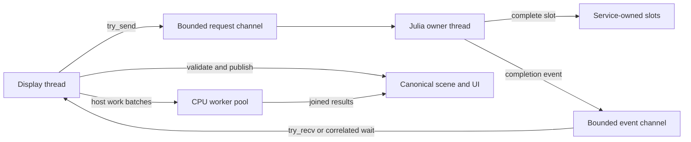

# Julia Owner Thread Architecture

## Table Of Contents

1. [Purpose](#purpose)
1. [System Model](#system-model)
1. [Source Map](#source-map)
1. [Runtime Service](#runtime-service)
1. [Startup And Readiness](#startup-and-readiness)
1. [Normal Frame Integration](#normal-frame-integration)
1. [Animation Tick Pipeline](#animation-tick-pipeline)
1. [View And Dynview Pipeline](#view-and-dynview-pipeline)
1. [Scratchpad Pipeline](#scratchpad-pipeline)
1. [Animation Lifecycle And Reload](#animation-lifecycle-and-reload)
1. [Lifecycle, Failure, And Diagnostics](#lifecycle-failure-and-diagnostics)
1. [Memory And Odin Context](#memory-and-odin-context)
1. [Shutdown](#shutdown)
1. [Correctness Invariants](#correctness-invariants)
1. [Verification Coverage](#verification-coverage)
1. [Current Constraints](#current-constraints)

## Purpose

Euclid embeds Julia as its content and animation runtime. Julia runs on one
persistent owner thread, not on the display thread. That thread initializes
Julia, executes Julia callbacks, inspects exceptions, reloads content, and shuts
the runtime down.

This document describes the implemented architecture. Its central rule is:

> Only the Julia owner thread may call the Julia C API, and ordinary
> asynchronous Julia work may affect display-owned state only through bounded
> published data.

Three publication protocols enforce that rule:

- Scratchpad requests and replies use copied fixed-capacity slots.
- View text and Dynview semantics use complete snapshots.
- Animation callbacks read immutable query snapshots and emit transactional
  scene-command batches.

Rare animation lifecycle operations remain synchronous. They first quiesce
asynchronous ticks, then run on the owner thread while the display thread waits
for the correlated completion.

## System Model

Euclid has three distinct execution roles:

- The **display thread** owns window events, raylib, GPU/audio resources, UI
  state, canonical scene state, fixed-step orchestration, and publication. It
  must not call the Julia C API or inspect worker-owned Julia handles.
- The **Julia owner thread** owns Julia lifetime, C API calls, callback
  execution, Scratchpad runtime, content registration, and reload. It must not
  render or concurrently mutate canonical scene state.
- The **CPU worker pool** is the bounded `src/taskpool` service. Its persistent
  workers run particle, constraint, shape draw-cache, and conditional Dynview
  compile/layout tasks, plus serialized CPU-only font preparation. The display
  owner may help execute queued tasks while waiting on a deterministic fence.
  Font preparation is polled asynchronously and finalized on the display thread.
  Tasks must not call Julia or thread-affine raylib APIs.

The Julia owner thread is not part of the CPU worker pool. It is a dedicated,
long-lived command processor with different ownership and shutdown rules.



## Source Map

| Concern | Primary files |
| --- | --- |
| Shared service and payload types | `src/core/core.odin` |
| Channels, worker loop, slots, publication, diagnostics | `src/bridge/runtime_service.odin` |
| Julia initialization and shutdown | `src/bridge/bootstrap.odin` |
| Animation scheduling, callback capture, lifecycle, reload | `src/bridge/animations.odin` |
| Immutable animation queries and scene batches | `src/bridge/scene_commands.odin` |
| Copied Scratchpad requests and replies | `src/bridge/scratchpad.odin` |
| Dynview raw-source ingestion and snapshots | `src/bridge/dynview_native_tex.odin`, `src/bridge/runtime_service.odin`, `src/dynview/**` |
| Frame-loop publication boundaries | `src/view/view.odin` |
| Host worker-pool windows | `src/view/simulation_executor.odin` |
| Julia callbacks and global loop | `src/julia/script.jl` |

## Runtime Service

`Julia_Runtime_Service` is allocated before Julia starts. It owns:

- one persistent `thread.Thread`
- one request channel and one event channel
- monotonically increasing request IDs
- lifecycle, reload, failure, and saturation diagnostics
- fixed Scratchpad, view-snapshot, and animation-tick slots
- worker-only Dynview staging storage
- animation pacing and latency counters

The service's `runtime_host` pointer is borrowed. Its GC ownership comes from the
worker-stack `Julia_Runtime_Gc_Frame`, installed before host construction and retained
until immediately before Julia teardown. The rooted `EuclidRuntimeHost` owns one active
generation, the persistent Scratchpad runtime state, and a borrowed pointer to the
lifetime-stable Odin application state. Scratchpad callbacks bind the host and reject an
ABI-provided state pointer that does not match that stored pointer. Replacing the active
content generation does not replace Scratchpad session or extension ownership. Odin
never roots Julia values by retaining their addresses in service state, and Julia never
frees the borrowed native pointer.

Both channels have capacity 16. Requests and events are small control records.
Large payloads do not travel through channels; channel records carry a slot
index whose storage remains owned by the service.

This distinction is important. A completion event may be drained before a
consumer is ready, but the completed payload remains in its slot until the
display thread publishes or releases it.

### Request And Event Types

Every accepted request receives a monotonically increasing `request_id`. Every
event repeats the request kind, request ID, slot index, and success state.

| Request | Worker action | Completion event |
| --- | --- | --- |
| `Initialize` | Initialize Julia and include the packaged script | `Initialized` |
| `Invoke` | Execute a serialized owner-thread task | `Invoke_Complete` |
| `Scratchpad` | Execute one copied Scratchpad operation | `Scratchpad_Complete` |
| `View_Snapshot` | Generate fallback text and Dynview semantics | `View_Snapshot_Complete` |
| `Animation_Tick` | Run Julia loops against a query snapshot and command batch | `Animation_Tick_Complete` |
| `Shutdown` | Tear Julia down and exit the worker loop | `Shutdown_Complete` |

Display-side submission uses `chan.try_send`. Queue saturation cannot
implicitly block the display thread. Failed insertion leaves the caller
responsible for recycling its slot or retrying required work, and increments
`request_saturation_count`.

The owner thread uses blocking `chan.recv` while idle and blocking `chan.send`
for completions. The bounded event channel can therefore apply backpressure to
the owner if the display stops draining events, without allowing memory growth.

### Worker Dispatch Loop

`julia_runtime_worker` records its operating-system thread ID, then processes
requests serially until `Shutdown`:

1. Receive one request.
1. Execute its request-kind-specific task.
1. Send exactly one correlated event.
1. Restore the worker's saved Odin context.
1. Clear the worker temporary allocator.

Serial execution is intentional. The architecture makes Julia concurrent with
rendering; it does not execute multiple Julia tasks at once.

`assert_julia_runtime_owner` guards externally reachable task boundaries before
they invoke Julia-backed helpers.

## Startup And Readiness

The window exists before Julia initialization begins, so startup can continue
drawing while the owner thread performs Julia work.

The sequence is:

1. Prepare packaged assets, using a separate startup worker when available.
1. Create the Julia runtime service and owner thread.
1. Submit `Initialize`.
1. Initialize Julia and include `src/julia/script.jl` on the owner thread.
1. Receive `Initialized` while drawing startup frames.
1. Allocate canonical host state on the display thread.
1. Submit `initialize_julia_state_task` through `Invoke`.
1. Resolve Julia handles and register content on the owner thread.
1. Receive `Invoke_Complete`.
1. Publish lifecycle state `Ready` only after registration and priming succeed.
1. Finish display-thread graphics and audio initialization.

`Initialized` does not mean normal runtime work is ready. The separate `Ready`
transition prevents animation, view, and Scratchpad work from observing a
partially registered interface.

After ten seconds without a startup completion, the loading label changes to
`Julia is not responding` and logs the request ID. Startup continues waiting
and rendering; closing the window terminates the process.

## Normal Frame Integration

The display loop performs Julia publication and submission at explicit points:

```text
apply completed Scratchpad replies
publish newest complete view snapshot
run zero or more fixed simulation steps
    publish newest valid animation tick
    schedule the next animation tick
    run and join particle + constraint tasks
run and join per-frame shape + optional Dynview preparation
request the next view snapshot
draw
```

There is no Julia call in the drawing path. Rendering consumes canonical host
state and previously published caches.

## Animation Tick Pipeline

Animation ticks are asynchronous, replaceable work tied to fixed simulation
time. Two service-owned slots bound storage, while policy allows only one
pending request.

Each `Animation_Tick_Slot` contains:

- request ID
- animation generation
- monotonically increasing tick sequence
- selected animation identity
- accumulated fixed-step delta
- submission timestamp
- immutable `Animation_Query_Snapshot`
- bounded `Scene_Command_Batch`

### Immutable Query State

Before submission, the display thread copies every value asynchronous Julia
animation code may query:

- the fixed point array
- packed typed animation values
- pen state
- compass state

During callback execution, `animation_query_snapshot_target` points to this
slot-owned copy. Query bridge functions use the snapshot rather than reading
canonical point or tool state concurrently.

The snapshot represents state at submission time. It deliberately does not
track canonical changes made while Julia is running.

### Transactional Scene Mutation

Before calling Julia animation loops, the owner thread attaches the slot's
`Scene_Command_Batch` as `scene_command_batch_target`. Mutating bridge exports
capture commands instead of directly applying them to canonical scene state.

The command vocabulary covers current recurring animation mutations:

- point position, color, brush, offset, and visibility
- bounded point-hide batches
- pen and compass locks, movement, visibility, and active state
- drawing-sound state
- particle emission
- animation cycle-boundary notification

The batch holds 64 commands. A point batch within one command holds up to eight
indices. Exceeding either bound marks the entire batch invalid.

Typed animation writes use a separate bounded pending-value buffer in the same
batch. Reads select the newest matching pending value before falling back to the
immutable query snapshot. Validation and commit publish typed values and scene
commands together, so a rejected scene command or typed write publishes neither.

The display validates the complete batch before applying any command. Validation
checks counts, overflow, producing-animation identity, explicit indices, tool
dependencies, and every bounded point-list index. Commands are applied in
callback order only after validation succeeds. Invalid, overflowed, stale, or
exception-producing batches have no partial effect.

### Fixed-Step Publication Boundary

Each fixed step uses this order:

1. Publish the newest completed animation result, if valid.
1. Schedule the next owner-thread animation tick.
1. Submit particle and constraint work to the CPU pool.
1. Join that simulation batch.
1. Continue GIF capture and any remaining fixed steps.

Publication immediately before constraints is a correctness boundary. Julia
may command raw pen or compass endpoint positions; constraints must normalize
that geometry before rendering or capture observes it.

The next tick's query snapshot is captured after publication and before the
current constraint task completes. Animation code sees committed command intent
at that boundary, while rendering sees the subsequently settled geometry.

### Stale Result Rejection

A completed animation tick can commit only when all of these remain true:

- its generation equals `animation_generation`
- its sequence is newer than `animation_last_committed_sequence`
- no animation reset is pending
- its animation is still both current and selected
- its scene-command batch validates

Selection, reset, and reload increment the animation generation and release
completed old-generation slots. Pointer identity also prevents publishing work
for a retired interface.

### Backpressure And Pacing

When one tick is pending, later fixed-step deltas are coalesced rather than
queued. Accumulated time is capped at 250 ms, preventing a slow callback from
creating an unbounded queue or catch-up spiral.

When submission becomes possible, accumulated time is included in the new
tick. If slot or request-channel reservation fails, elapsed time is retained
for a later attempt and the drop counter advances.

Under sustained Julia overload, logical animation time is therefore coalesced
and capped while display, input, simulation, and rendering continue.

## View And Dynview Pipeline

View generation is independent of drawing. Two service-owned snapshot slots
provide one published generation and one replacement generation.

Each `View_Snapshot` owns:

- request ID and monotonically increasing snapshot generation
- producing-animation identity
- one growing arena and bounded builders for fallback text, command text, commands,
  math programs, math commands, and math nodes
- up to 32 KiB of fallback text
- up to 1,024 Dynview commands and 32 KiB of command text
- up to 256 math programs
- up to 4,096 math commands
- up to 4,096 math nodes

Only one view request may be pending. Additional frame requests are suppressed
until its completion event clears `view_snapshot_pending`.

Slots retain the `Free`, `Pending`, `Complete`, and `Published` lifecycle. A slot arena
is reset and its builders are reinitialized only after the display has returned that
slot to `Free` and reservation selects it for another generation. Saturated slots,
stale completions, superseded completions, and published aliases therefore cannot lose
storage before release. All six payload families use sealed arena-backed slices.

### Owner-Thread Generation

The owner resets `dynview_staging`, redirects `dynview_emit_target` to that
worker-only runtime, and calls the selected animation's view callback. Fallback
text and every populated semantic span are copied into the reserved snapshot
before completion.

TeX source submitted by the thin Julia facade is classified, parsed, and interned
natively on this owner-controlled ingestion path. Interned documents live in
animation-generation memory only long enough to be resolved and copied; handles and
arena pointers never enter a `View_Snapshot`.

No returned string may depend on the worker temporary allocator after task completion.
The worker appends fallback and semantic command bytes into the reserved slot's bounded
byte builders, then appends commands, math programs, math commands, and math nodes into
typed bounded builders. Each transfer seals all of its populated prefixes and publishes
no aliases unless every family succeeds. Fallback retains its prior 32 KiB truncation
policy; semantic byte or record overflow rejects the candidate.

### Display Publication

The display selects the newest completed snapshot by generation without
depending on event order. It requires a closed, error-free Dynview stream before import.

Validation requires all six slices to alias their sealed builder prefixes. It checks
primary, copy, script-base, superscript, subscript, and radical-index spans in every base
and math command, plus math-program ranges, roots, node text, child ranges, and child
indexes. The display installs immutable views of semantic bytes and records before
releasing the previous published slot. Fallback text and semantic views continue to
alias that slot until replacement or invalidation.

Publication also requires the producing animation to remain current. A stale
snapshot is released, and old published content is cleared rather than shown
beneath a new selection.

A valid snapshot becomes the display's immutable Dynview content view. Compilation reads
commands and text directly from that view. Math measurement and shaping seed a separate
display-owned mutable working cache because derived metrics and shaped-run indexes are
not semantic snapshot state. Replacement installs all new aliases before recycling the
previous slot; invalidation and shutdown clear every alias before slot reuse or arena
destruction.

### Compile And Layout

Publication invalidates display-owned Dynview compile and layout caches.
`prepare_ui_frame` then computes exact panel bounds and tracks panel, font, and
style inputs.

The per-frame CPU-pool window runs:

- shape draw-cache construction every frame
- Dynview compilation and layout only when invalidated

`Dynview_System` owns one growing display-cache arena initialized before executor
publication. The submitted Dynview task alone enters worker-mutable ownership, resets
the arena for an invalidated rebuild, and returns display-readable ownership before
fence completion. Fence waiting may execute queued work on the display thread, so
ownership is defined by task role and guarded execution identity rather than by
requiring a distinct operating-system thread. Failed builds clear partial derived
views, record a stable error, and retain source fallback. Unchanged frames do not reset
the arena; shutdown destroys it after the task pool has joined and stopped.

Bounded builders compile plain text and copy payload bytes into this arena while
preserving the existing logical text limit. Both builders seal before either populated
slice is published. Those slices are display-readable aliases whose lifetime ends at
the next invalidated cache-arena reset; failure clears both aliases before returning to
source fallback. A bounded copy-block builder participates in the same transaction and
seals before any compiled bytes or blocks publish, preserving source order and payload
spans under the command-count limit.

Copy hit targets are panel- and scroll-dependent display geometry. After the worker
fence returns display ownership, the display thread clears and repopulates one reusable
bounded target builder from the sealed copy blocks and fixed layout records. Repeated
frames retain its allocated arena capacity rather than abandoning storage. Each
successful refresh publishes only its populated prefix; failure publishes no targets.
All copy-record aliases and reusable builder state are cleared before an invalidated
arena reset.

Bounded line and item builders construct the layout while the invalidated Dynview task
owns worker-mutable cache state. Item indexes, line indexes, grid placement, clipping,
and scalar counts update against populated builder prefixes during measurement. After
all commands and aggregate scroll metrics validate, both builders seal before
`layout_is_valid` publishes their display-readable slices. Empty content still seals
one canonical line. Overflow or invalid layout clears both aliases and preserves source
fallback. Their lifetime ends at the next invalidated cache-arena reset.

Shaped-run and glyph builders use the same arena while enforcing the existing
math-command and shaped-glyph limits. They publish complete populated slices only after
validating the current font generation and every source, glyph, and command-site span.
Failure clears all shaped aliases and restores every command-site fallback sentinel.
Recursive math measurement consumes these records after the shaping pass. Recursive
draw items retain their source math-command index so the display thread can consume the
exact same command/site record without reshaping or reconstructing advances.

Dynview owns a separate generation-tagged NewCM HarfBuzz capability. The display
thread builds a complete candidate from the resident `Math_Regular` source after font
service and before frame submission. Successful replacement invalidates font/layout
state; failed replacement preserves the prior capability and suppresses repeated work
for that failed generation. Its mutable HarfBuzz buffer is distinct from the font
cache buffer and is available only to the Dynview frame-preparation worker. The joined
fence returns read ownership before drawing. Shutdown destroys this capability after
worker completion and before retiring font generations.

The capability provides bounded left-to-right `math` script shaping, glyph extents,
italic correction, and top-accent attachment. Native TeX semantics distinguish
italic-variable and upright math runs. The worker shaping call strictly projects
eligible source scalars into caller-owned temporary bytes; command-buffer, fallback,
and copy text remain unchanged. Malformed roles, UTF-8, or insufficient workspace fail
without publishing a shape. Production math measurement consumes complete cached runs
and approved MATH attachments while preserving whole-run fallback, existing prose
measurement, and outer-grid policy. Drawing validates the matching resident
`Math_Regular` generation and complete glyph residency before drawing cached 26.6
offsets and advances. A stale generation, invalid slice, or pending glyph rejects the
whole site before the existing fallback path runs.

These tasks write disjoint caches and may run concurrently. The display joins
the preparation batch before drawing, making panel rendering cache-only. Scroll
state, copy-hit targets, and interaction remain display-thread work.

## Scratchpad Pipeline

Scratchpad UI operations use 16 service-owned slots. Each slot has a 4 KiB input
buffer and a 4 KiB result buffer.

Supported operations are submit and parse classification, completion, history
navigation, history cursor reset, and history save.

Submission copies text, caret position, and input generation into a free slot.
The owner invokes Julia and copies result text into the same slot. Completion
events enqueue slot indices in a bounded FIFO, preserving worker completion
order.

Complete submissions also copy their runtime request ID into Julia's bounded
input queue. Evaluation reports that ID to worker-owned host state only after the
queued entry finishes. The next successfully generated view snapshot carries the
ID and runtime generation; display publication emits `Scratchpad_Completed` only
after the snapshot passes lifecycle and structural validation and becomes visible.
Reload publication and shutdown discard any uncommitted worker watermark.

UI application uses request identity and input generations to prevent stale
completion, history, or submission replies from overwriting newer edits. The
display explicitly returns each consumed slot to `Free`.

A submit classifies input first. Incomplete input preserves multiline editing;
complete input is queued in Julia; parse errors remain visible to the editor.
Queued evaluation runs inside Julia's global loop during an animation tick, so
supported scene mutations use the same query-snapshot and command-batch
boundary as animation code.

Slot exhaustion or request-channel saturation rejects a new request without
blocking. UI callers must retain or visibly reject required user intent rather
than assuming every attempted submission was accepted.

## Animation Lifecycle And Reload

Selection, reset, and reload are not ordinary replaceable ticks. They may create
objects, rebuild registries, replace Julia handles, and require synchronous IDs
within one callback.

`synchronize_animation_lifecycle` handles this exception:

1. Refuse to begin while an animation tick is pending.
1. Enter reload state `Quiescing`.
1. Submit `update_animation_lifecycle_task` through `Invoke`.
1. Block for that correlated completion while accepting unrelated events.
1. Increment `animation_generation` after success.
1. Clear accumulated tick time and completed old-generation slots.

This compatibility barrier is deliberate and narrow. It preserves exclusive
access while lifecycle callbacks rebuild canonical scene and registry state.
Ordinary animation, view, and Scratchpad paths remain asynchronous.

### Staged Reload

Packaged asset modification time drives reload. The owner-thread lifecycle task
uses these states:

```text
Quiescing -> Including -> Registering -> Publishing -> Idle
                                      \-> Failed
```

Reload does not retire the active interface before a replacement is usable:

1. Re-extract changed packaged assets and preserve the active animation UUID.
1. Construct a fresh anonymous `EuclidRuntimeGeneration` under a local GC root.
1. Give that generation fresh catalog, load-cache, module, and implementation roots.
1. Clear and resolve the inactive state-owned interface slot.
1. Register candidate metadata and restore the active UUID against that slot.
1. Validate the candidate animation's direct Enter operation.
1. Commit the host's active generation with one assignment.
1. Publish the candidate interface and clear the retired slot.

`Euclid_General_State` owns exactly two inline `Euclid_Julia_Interface` slots.
Their addresses remain stable for the complete host-state lifetime. Reload
does not allocate or free interface structs. Each slot retains its own growing
registry arena so a candidate can coexist with the active generation while
registration and stable-ID restoration are validated.

If construction, registration, loading, or Enter fails, the candidate registry arena is
cleared, the previous slot is restored, full Julia GC is forced while the stable host
still roots the old generation, and the previous animation is reset. The failed
package modification time is retained so the same broken revision is not
retried every frame. A newer revision may trigger another attempt.

Scenario-only one-shot failure selectors exercise candidate-load and candidate-Enter
rollback through this production transaction. They are Odin-owned, consumed once, and
cleared on either publication or rollback; Julia has no mutable fault-injection global.

Successful publication increments `runtime_generation`, clears the failed
revision marker, and resets the display-owned Scratchpad editor state to match
the new Julia session. View snapshots carry this runtime generation in addition
to animation identity, preventing a recycled arena address from validating an
old snapshot after later reloads.

## Lifecycle, Failure, And Diagnostics

The service lifecycle is:

```text
Not_Started -> Starting -> Ready -> Shutdown_Requested -> Stopped
                    \-------------------------------> Failed
```

Readiness is published after initialization and content registration.
Initialization or shutdown completion failure marks the lifecycle terminally
`Failed`. Ordinary request failures do not stop the runtime; they update
attributed diagnostics.

`Julia_Runtime_Diagnostics` exposes display-safe scalar state:

- lifecycle state
- active request ID and kind
- total failed requests
- last failed request ID and kind
- request-channel saturation count
- reload state
- runtime generation

`Animation_Tick_Diagnostics` additionally exposes queue depth and high water,
submitted, committed, coalesced, stale, and dropped counts, the last committed
sequence, and last and maximum publication latency.

These snapshots do not invoke Julia or expose Julia-owned handles. Julia
exceptions are reported at their bridge boundary. A failed animation callback
invalidates its batch, preventing partial publication.

## Memory And Odin Context

Cross-thread payload storage is fixed and service-owned. Normal frame operation
does not allocate request payloads for animation ticks, view snapshots, or
Scratchpad requests.

### Host Allocation Ownership

- `Euclid_General_State` is allocated once by the display thread with its
  persistent context allocator. Both Julia interface structs are inline in
  this allocation and have no separate allocator or deallocation path.
- `Julia_Runtime_Service` and its worker-only `Dynview_System` staging object
  are allocated once with the startup context allocator. The service owns and
  frees both after the Julia worker has stopped.
- Request and event channels each allocate one fixed capacity-16 buffer with
  the startup context allocator. The service destroys both during teardown.
- `thread.create_and_start_with_data` owns the persistent worker's platform
  thread resources. `thread.destroy` releases them after `Shutdown_Complete`.
- Scratchpad slots, view snapshots, animation tick slots, query snapshots, and
  scene-command batches are inline in `Julia_Runtime_Service`. Request traffic
  does not allocate these payloads.
- Each view snapshot additionally owns one growing arena. The service initializes these
  arenas in place, resets one only when reusing a `Free` slot, and destroys all of them
  after the Julia worker has stopped. Initialized arena owners are never copied. Sealed
  text and semantic record slices remain valid for the complete slot generation, and
  display aliases are detached before their owning slot can be reset or destroyed.

### Registry Arena Ownership

Each interface slot lazily creates one growing virtual-memory arena during its
first content registration. That arena owns the complete generation registry:

- animation interface nodes
- copied animation names
- UUID lookup-table buffers

`prepare_julia_interface_generation` calls `arena_free_all` before reusing an
inactive slot. Rollback clears the failed candidate arena. Successful
publication clears the retired arena after the active-slot switch. Clearing
retains arena infrastructure for the next reload; application teardown calls
`arena_destroy` for both slots.

No pointer into a cleared registry arena may be dereferenced. Animation ticks
use lifecycle generations, and view snapshots use runtime generations plus
animation identity, before accepting data that contains registry pointers.

### Temporary Allocator Ownership

The owner captures its initial Odin context. `initialize_julia_state_task` also
stores a valid runtime context in `Euclid_General_State.saved_context`.
Exported bridge entrypoints restore this context before allocation-sensitive
Odin work.

After every non-shutdown request, the worker restores its original context and
clears its temporary allocator. Therefore:

- worker temporary strings must be copied before task completion
- slot payloads must not point into temporary storage
- long-lived bridge state must have an explicit persistent owner
- bridge callbacks must restore `saved_context` before allocating helpers

The display separately clears its frame temporary allocator after drawing.

## Shutdown

Normal shutdown is cooperative and owner-thread-affine:

1. Retry nonblocking insertion of `Shutdown` while draining events.
1. Call `jl_atexit_hook` through `end_julia` on the owner thread.
1. Send `Shutdown_Complete` and exit the owner loop.
1. Join/destroy the stopped worker.
1. Destroy snapshot-slot arenas, staging storage, and both channels.
1. Destroy both interface registry arenas and free canonical host state.

Shutdown request saturation or missing completion after five seconds is
terminal. The process exits because an arbitrary Julia C call cannot be safely
killed and recovered in-process.

Service destruction is valid only after shutdown completion. Destroying a live
owner would violate Julia lifetime ownership and could strand queued payloads.

## Correctness Invariants

1. Every Julia C API call executes on the persistent owner thread.
1. Every owner-thread request emits one correlated completion event.
1. Channel payload pointers refer only to storage that outlives the request.
1. Animation bridge queries read the active immutable query snapshot.
1. Recurring animation mutations are captured in a bounded scene batch.
1. Scene batches validate completely before any canonical mutation.
1. Animation results publish at a fixed-step boundary before constraints.
1. View snapshots publish only after complete semantic validation.
1. Slot state is recycled only by the responsible consumer.
1. Selection, reset, and reload invalidate asynchronous old-generation work.
1. Rendering performs no Julia call and consumes only joined host caches.
1. Julia owner work never calls thread-affine raylib rendering APIs.

Using the request channel alone does not make a callback safe. Its reads and
writes must also use the correct snapshot, command, or copied-slot protocol.

## Verification Coverage

Odin view tests cover ordered scene-command commit, atomic invalid-batch
rejection, deferred mutation, tool dependency validation, immutable animation
queries, generation and sequence rejection, bounded tick coalescing, failure
attribution, reload failure tracking, Dynview snapshot validation, newest
completion selection, stale-view clearing, stale Scratchpad reply rejection,
display-committed Scratchpad correlation and evidence loss, and repeated host
worker-pool joins.

Julia tests cover Scratchpad, bridge helpers, geometry, LaTeX, and
runtime-facing content behavior. The required repository gate is:

```sh
cmake --preset default
cmake --build --preset default --target check
```

This runs the validated build, repository analysis, and all tests.

Automated tests do not prove visual timing, responsiveness during an arbitrary
stuck Julia C call, or platform-specific embedding behavior. Release validation
must still exercise startup, selection, reset, Scratchpad evaluation, valid and
invalid reloads, induced Julia delay, and shutdown on supported platforms.

## Current Constraints

- Julia work is serialized on one owner thread. A slow request delays later
  Julia requests, although ordinary display frames continue.
- Animation lifecycle operations use a synchronous compatibility barrier after
  ticks quiesce. Selection, reset, and reload may briefly stall display.
- Animation overload coalesces and caps logical time instead of guaranteeing
  every intermediate tick.
- View generation is requested once per frame when no request is pending; it is
  not driven by a complete semantic invalidation graph.
- Scratchpad and request saturation are bounded rejection conditions. Required
  UI intent must handle unsuccessful submission explicitly.
- Startup can report an unresponsive owner but cannot safely cancel an
  arbitrary Julia call in-process.
- Shutdown timeout is terminal because Julia cannot be forcefully unwound while
  preserving process integrity.

These are current operating characteristics. Changes to them must
preserve the ownership, boundedness, and atomic-publication invariants above.
