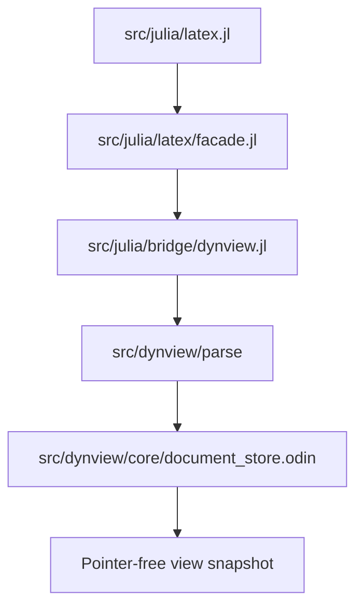
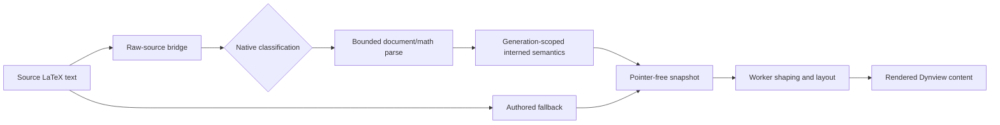

# LaTeX Support

This document describes the LaTeX subset supported by Dynview's native parser
and layout pipeline. The implementation supports both standalone math and
mixed document fragments containing styled prose, inline or display math, line
breaks, and Euclid inline shapes.

## Table Of Contents

1. [Recommended Usage](#recommended-usage)
1. [Modes And Classification](#modes-and-classification)
1. [Document Mode](#document-mode)
1. [Math Mode](#math-mode)
1. [Display-Math Layout Contract](#display-math-layout-contract)
1. [Character Support](#character-support)
1. [Matrix Support](#matrix-support)
1. [Delimiter Support](#delimiter-support)
1. [Cache And Invalidation](#cache-and-invalidation)
1. [Fallback And Failure Behavior](#fallback-and-failure-behavior)
1. [Practical Authoring Tips](#practical-authoring-tips)
1. [Known Limitations](#known-limitations)
1. [Appendix: Module Architecture](#appendix-module-architecture)
1. [Summary](#summary)

## Recommended Usage

Use `EuclidLatex.emit_latex_view_text!` for complete animation view text. It
submits source and the supplied fallback to Dynview, which classifies and parses
the complete input, builds one semantic stream, and uses the fallback as the copy
payload. The facade always returns the fallback string expected by `get_view_text`.

```julia
const DefinitionLatexDocument = raw"""\textbf{Definition 1.}

A point is that which has no part. The symbol $A_1$ marks a point.

\euclidpoint[color=plum1,size=1]
"""

const DefinitionFallback = "Definition 1. A point is that which has no part."

function get_view_text(state_ptr)
    EuclidLatex.emit_latex_view_text!(
        state_ptr,
        DefinitionLatexDocument,
        DefinitionFallback)
end
```

Use `replay_emit_math_block!` when a Dynview block is already open and only one
math expression needs to be inserted. It submits one source-based, non-wrapping math
block and returns `false` on bridge failure.

## Modes And Classification

The native parser selects one of two modes:

| Mode | Intended source | Main API |
| --- | --- | --- |
| Math | One standalone expression | `replay_emit_math_block!` |
| Document | Prose mixed with styling, math, breaks, or shapes | `emit_latex_view_text!` |

A fragment enclosed entirely by `$...$`, `$$...$$`, `\(...\)`, or `\[...\]`
is classified as math. Otherwise, document markers such as `\textbf`,
`\textit`, `\emph`, `\newline`, `\\`, `\euclid...`, or embedded math
delimiters select document mode. Plain unmarked source is treated as math for
backward compatibility.

Dynview strips a complete outer math delimiter before parsing math mode. In document
mode it parses the full source into typed native semantic records;
partial document parsing is not accepted.

## Document Mode

Document mode supports a deliberately small LaTeX-like prose language:

- Plain Unicode text.
- `\textbf{...}` for bold text.
- `\textit{...}` and `\emph{...}` for italic text.
- `\textcolor{color}{...}` for inline prose color.
- Nested style commands; flags accumulate, so bold italic text is supported.
- Inline math with `$...$` or `\(...\)`.
- Display math with `$$...$$` or `\[...\]`.
- Forced line breaks with `\\` or `\newline`.
- Paragraph breaks from a blank source line.
- Inline Euclid shapes through `\euclidpoint`, `\euclidline`,
    `\euclidcircle`, `\euclidbox`, `\euclidangle`, `\euclidsemicircle`,
    `\euclidperpendicular`, `\euclidtriangle`, and `\euclidpentagon`.

A single source newline in prose normalizes to one space. A blank line emits a
paragraph break. Display math receives surrounding line breaks unless adjacent
document runs already provide them.

Inline and display math select different TeX math styles. `$...$` and `\(...\)`
compile at Text style; `$$...$$` and `\[...\]` compile at Display style. Text style
keeps fraction branches script-sized with tighter shifts, places large-operator limits
beside the operator instead of above and below, and suppresses display operator
variants, so inline math stays close to the height of surrounding prose. Source with no
outer delimiter is treated as a standalone expression and uses Display style.

### Inline Text Colors

`\textcolor{color}{...}` applies a brush color to nested document text while
preserving bold and italic font flags. Color names resolve in this order:

1. All CSS/SVG and X11 names exposed by `Colors.color_names`, including
    numbered variants such as `antiquewhite4` and `grey60`.
1. Euclid's Julia palette: `julia_blue`, `julia_red`, `julia_green`, and
    `julia_purple`.
1. The enclosing document color when the name is unresolved; at the root this
    means the caller's normal Dynview text color.

Color wrappers may be nested with each other and with `\textbf`, `\textit`,
or `\emph`. This basic support colors prose text runs; embedded math retains
its own rendering color rules. Inline Euclid shape color options use the same
Colors.jl names and explicit `julia_*` aliases.

```julia
raw"Normal \textcolor{red}{red and \textbf{bold red}} normal"
raw"\textcolor{julia_blue}{Julia blue}"
raw"\textcolor{steelblue}{Colors.jl named color}"
```

### Inline Euclid Shapes

Shape commands accept an optional comma-separated bracket payload. Keys cannot
be duplicated, dimensions must be finite and positive, booleans are strictly
`true` or `false`, and colors must resolve through the bridge color vocabulary.

- `\euclidpoint`: options are `color` and `size`. The default is `size=1`,
    and points are always filled.
- `\euclidline`: options are `color`, `length`, and `thickness`. Defaults are
    `length=3` and `thickness=1`.
- `\euclidcircle`: options are `color`, `size`, `thickness`, and `filled`.
    Defaults are `size=1`, `thickness=1`, and `filled=false`.
- `\euclidbox`: options are `color`, `width`, `height`, `thickness`, and
    `filled`, plus per-edge overrides `edge1_color`, `edge2_color`,
    `edge3_color`, and `edge4_color`. Defaults are `width=2`, `height=1`,
    `thickness=1`, and `filled=false`.
- `\euclidangle`: options are `color`, `radius`, `start`, `end`,
    `thickness`, `filled`, `fill_color`, and `arc_color`. Defaults are
    `radius=1`, `start=0`, `end=90`, `thickness=1`, and `filled=false`.
- `\euclidsemicircle`: shorthand for a top-half angle marker. Options are
    `color`, `radius`, `thickness`, `filled`, `fill_color`, and `arc_color`.
    It always uses `start=0` and `end=180` internally.
- `\euclidperpendicular`: options are `color`, `length`, `width`, `height`,
    `thickness`, `line1_color`, and `line2_color`. Defaults are `length=2`,
    `height=1`, and `thickness=1`. `width` is accepted as an alias for
    `length`.
- `\euclidtriangle`: options are `color`, `width`, `height`, `thickness`,
    `filled`, `fill_color`, `edge1_color`, `edge2_color`, and
    `edge3_color`. Defaults are `width=1`, `height=width`, `thickness=1`, and
    `filled=false`.
- `\euclidpentagon`: options are `color`, `width`, `height`, `thickness`,
    `filled`, `fill_color`, `edge1_color`, `edge2_color`, `edge3_color`,
    `edge4_color`, and `edge5_color`. Defaults are `width=1`,
    `height=width`, `thickness=1`, and `filled=false`.

The shorthand option `filled` is equivalent to `filled=true`.

Examples:

```julia
raw"\euclidpoint[color=steelblue,size=1]"
raw"\euclidline[color=steelblue,length=4,thickness=2]"
raw"\euclidcircle[color=khaki3,size=2,filled]"
raw"\euclidbox[width=3,height=2,thickness=1,filled=false]"
raw"\euclidbox[color=steelblue,width=3,height=2,thickness=2,edge1_color=steelblue,edge2_color=teal,edge3_color=olive,edge4_color=cyan]"
raw"\euclidangle[color=steelblue,radius=2,thickness=2,start=20,end=140]"
raw"\euclidsemicircle[color=steelblue,radius=2,thickness=2]"
raw"\euclidperpendicular[color=steelblue,length=2,height=1,thickness=2,line1_color=cyan,line2_color=yellow]"
raw"\euclidtriangle[color=steelblue,width=2,height=1.5,thickness=2,filled,fill_color=lightgray,edge1_color=red,edge2_color=green,edge3_color=blue]"
raw"\euclidpentagon[color=steelblue,width=2,height=2,thickness=2,filled,fill_color=lightgray,edge1_color=red,edge2_color=green,edge3_color=blue,edge4_color=teal,edge5_color=orange]"
```

Document mode does not implement general LaTeX commands or environments.
Unknown commands, malformed delimiters, invalid shape options, or unmatched
style braces cause document parsing to fail and structured output to fall back.

## Math Mode

Math mode supports these major groups:

- Unicode substitution commands for many Greek letters, operators, relations,
  arrows, and set symbols.
- Upright text operators like `\sin`, `\cos`, `\log`, `\lim`, `\max`.
- Declared operators: `\operatorname{...}` uses ordinary side scripts, while
    `\operatorname*{...}` stacks display-style limits by default and accepts
    `\limits`, `\nolimits`, and `\displaylimits`.
- `\text{...}` and `\mathrm{...}` for non-italic text inside math.
- Grouped mathematical alphabets: complete alphanumeric `\mathbb` and `\mathbf`,
    alphabetic `\mathit`, and uppercase `\mathcal`.
- Scripts: `^` and `_` including grouped forms.
- Scoped math styles: `\displaystyle`, `\textstyle`, `\scriptstyle`, and
    `\scriptscriptstyle`; each declaration applies through the end of its current group.
- Fractions: `\frac{...}{...}`, `\dfrac{...}{...}`, and `\tfrac{...}{...}`.
- Ruleless binomial stacks: `\binom{...}{...}`, `\dbinom{...}{...}`, and
    `\tbinom{...}{...}`.
- Radicals: `\sqrt{...}` and `\sqrt[n]{...}`.
- Accent rules: `\overline{...}` and `\underline{...}`.
- Glyph accents: `\hat`, `\widehat`, `\tilde`, `\widetilde`, `\vec`, `\dot`,
    `\ddot`, `\bar`, `\check`, `\breve`, `\acute`, `\grave`, and `\mathring` use
    MATH attachment points and horizontal constructions.
- Stretch delimiters: `\left ... \right` with mixed delimiter pairs and structural
    `\middle` markers. Every visible delimiter in a group shares one measured extent.
- Fixed delimiter families: `\big`, `\Big`, `\bigg`, and `\Bigg`, including their
    `l`, `r`, and `m` atom-class variants.
- Over/under structures: `\overset`, `\underset`, `\overbrace`, and `\underbrace`;
    ordinary scripts may annotate the completed brace construct.
- Large operators with semantic growth and limit policies: `\sum`, `\prod`,
    `\coprod`, `\int`, `\oint`, `\iint`, `\iiint`, `\lim`, and common n-ary
    operators. `\limits`, `\nolimits`, and `\displaylimits` override placement when
    they immediately follow a large operator.
- Matrix blocks: `\begin{matrix} ... \end{matrix}` and
    `\begin{array}{...} ... \end{array}` with `&` column separators, `\\`
    row separators, boundary rules, and typed row additions.
- Matrix wrapper environments composed through stretch delimiters: `bmatrix`,
    `Bmatrix`, `pmatrix`, `vmatrix`, and `Vmatrix`.
- Spacing markers: `\,`, `\:`, `\>`, `\;`, `\!`, a backslash followed by a
    literal space, `\enspace`, `\quad`, `\qquad`, and `~`.

## Display-Math Layout Contract

Dynview parses supported LaTeX into semantic atoms, explicit glue, and bounded child
programs, then copies those records into the immutable snapshot. The worker owns all
font-sensitive measurement against the active Math_Regular generation. The measurement
root is Display
style; inline math scopes itself to Text style through the same recursive style-override
primitive that serves `\displaystyle` and `\textstyle`. Fractions, scripts, limits, and
radical degrees derive text, script, script-script, and cramped child styles as required.

The math root size is the surrounding text size multiplied by a measured optical scale
that matches NewCM's lowercase ink height to JuliaMono's, equivalent to `unicode-math`'s
`Scale=MatchLowercase`. That factor is captured with the OpenType MATH constants and
shares their generation, so a font republication invalidates it with everything else. It
is applied once at the root, and every MATH-relative construction follows from it.

Successful native layout uses NewCM's OpenType MATH data for:

- style scaling, axis placement, script constraints, fraction and bar geometry;
- ruleless stack shifts and minimum gaps;
- operator variants and limit placement;
- radical and delimiter variants or bounded assemblies;
- horizontal brace variants or bounded assemblies and stretch-stack annotation gaps;
- height-dependent corner kern after final script placement;
- glyph-accent attachment, horizontal variants, and flattened-accent shaping.

Measurement seals child positions and baselines, rule geometry, selected glyph IDs,
assembly offsets, and the exact font generation into immutable layout records. Drawing
uses that geometry directly and never selects a different variant or recomputes a
typographic placement.

Synthetic script, fraction, bar, radical, delimiter, operator, and accent geometry is
retained only as a bounded fallback. A missing or stale capability, rejected native
record, over-capacity construction, or pending glyph page rejects the complete native
path rather than mixing generations or partially drawing a construction. Per-item
native-geometry validity and generation fields expose which path was sealed; font-page
demand and fallback resolution are also retained in generation-local telemetry.

The bridge record is mirrored field-for-field in Julia and Odin. Atom, glue, style,
operator-policy, span, and child-count validation occurs before import. Scripts,
fraction branches, and radical degrees retain recursive child identities across the
boundary; fallback text is never reparsed to recover structure on the Odin side.

### Line Bands And Ink Overflow

Document lines occupy whole grid rows. A line reserves an additional row only when its
ink cannot be accommodated, and ink is permitted to rise into the unused leading of the
preceding line rather than forcing a taller band. This is TeX's `\lineskiplimit`
behavior: the baseline lattice is preserved even though ink protrudes past a band.

The allowance for one line is the exact unused space left below the preceding line's
lowest ink, so a permitted overflow can never collide. Ink below the baseline always
reserves rows, which is what keeps that allowance sound. Display math is the deliberate
exception and still claims its own multi-row band.

## Character Support

Character handling is practical and intentionally limited. Fixed commands use
`MATH_COMMAND_REGISTRY` for output, role, atom class, operator family, growth,
and limit policy. Grouped mathematical alphabet commands use audited Unicode
Mathematical Alphanumeric Symbols rendered by the same authoritative NewCM math
face. This is not general TeX compatibility.

- ASCII letters, digits, and punctuation are the best default for authored
    math source. Examples include `a`, `x_1`, `+`, `(`, and `)`.
- `\`, `{`, `}`, `[`, `]`, `^`, `_`, and `&` are parser-significant structural
    characters.
- Fixed command substitutions such as `\alpha`, `\leq`, and `\mathbb{R}` are
    supported only when listed below.
- `\text{...}` supports upright plain text inside math mode.
- Raw Unicode math symbols such as `α`, `≤`, and `∑` render best effort. Command
    forms are more reliable for parser and style behavior.
- Arbitrary TeX-special characters and unlisted environments are unsupported.

For angle-notation prefix commands, one delimiter whitespace run after the
command is ignored when it is followed by an inline alphanumeric token.
Examples:

- `\angle ABC` renders as `∠ABC`.
- `\angle\ ABC` preserves a literal space and renders as `∠ ABC`.
- `\angle~ABC` renders with a nonbreaking space as `∠\u00a0ABC`.

This delimiter-whitespace behavior is intentionally limited to
`\angle`, `\measuredangle`, and `\sphericalangle`. That may change in the future with more
active development on this engine.

Practical rule: if a symbol matters, prefer its LaTeX command form over raw
character entry.

### Greek Letter Command Coverage (Current Fixed Set)

- Lowercase Greek: `\alpha`, `\beta`, `\gamma`, `\delta`, `\epsilon`,
  `\varepsilon`, `\zeta`, `\eta`, `\theta`, `\vartheta`, `\iota`, `\kappa`,
  `\varkappa`, `\lambda`, `\mu`, `\nu`, `\xi`, `\pi`, `\rho`, `\varrho`,
  `\sigma`, `\varsigma`, `\tau`, `\upsilon`, `\phi`, `\varphi`, `\chi`,
    `\psi`, `\omega`, `\varpi`, and `\digamma`.
- Uppercase Greek: `\Gamma`, `\Delta`, `\Theta`, `\Lambda`, `\Xi`, `\Pi`,
  `\Sigma`, `\Upsilon`, `\Phi`, `\Psi`, `\Omega`.
- Hebrew-style symbols: `\aleph`, `\beth`, `\gimel`, `\daleth`.

### Math Symbol Command Coverage (Current Fixed Set)

- Basic operators: `\pm`, `\mp`, `\times`, `\div`, `\cdot`, `\ast`, `\star`,
    `\bullet`, `\circ`, `\diamond`, `\rtimes`, `\setminus`, and `\wr`.
- Circled and square operators: `\oplus`, `\ominus`, `\otimes`, `\oslash`,
    `\odot`, `\bigcirc`, `\sqcap`, `\sqcup`, and `\uplus`.
- Triangle operators: `\bigtriangleup`, `\bigtriangledown`, `\triangleleft`,
    `\triangleright`, `\lhd`, `\rhd`, `\unlhd`, and `\unrhd`.
- Additional operators: `\dagger`, `\ddagger`, and `\amalg`.
- Calculus and analysis: `\infty`, `\partial`, `\nabla`, and `\propto`.
- Large operators: `\sum`, `\prod`, `\coprod`, `\int`, `\oint`, `\iint`,
    `\iiint`, `\bigcup`, `\bigcap`, `\bigvee`, `\bigwedge`, `\bigsqcup`,
    `\biguplus`, `\bigoplus`, `\bigotimes`, and `\bigodot`.
- Logic and quantifiers: `\forall`, `\exists`, `\nexists`, `\neg`, `\land`,
    `\lor`, `\wedge`, `\vee`, `\therefore`, `\because`, `\top`, and `\bot`.
- Set membership: `\in`, `\notin`, `\ni`, `\owns`, and `\notni`.
- Set relations: `\subset`, `\subseteq`, `\subsetneq`, `\nsubseteq`,
    `\supset`, `\supseteq`, `\supsetneq`, `\nsupseteq`, `\sqsubset`,
    `\sqsubseteq`, `\sqsupset`, and `\sqsupseteq`.
- Set operations: `\cup`, `\cap`, `\emptyset`, `\varnothing`, and
    `\complement`.
- Ordering and equality: `\le`, `\leq`, `\ge`, `\geq`, `\ll`, `\gg`, `\ne`,
    `\neq`, `\approx`, `\equiv`, `\prec`, `\succ`, `\preceq`, and `\succeq`.
- Relatedness: `\sim`, `\simeq`, `\cong`, `\asymp`, `\doteq`, `\parallel`,
    `\nparallel`, `\mid`, `\nmid`, `\perp`, `\models`, `\vdash`, `\dashv`,
    `\bowtie`, `\smile`, and `\frown`.
- Basic arrows: `\to`, `\rightarrow`, `\leftarrow`, `\leftrightarrow`,
    `\uparrow`, `\downarrow`, `\updownarrow`, `\Rightarrow`, `\Leftarrow`,
    `\Leftrightarrow`, `\iff`, `\Uparrow`, `\Downarrow`, and `\Updownarrow`.
- Long and hooked arrows: `\longleftarrow`, `\longrightarrow`,
    `\longleftrightarrow`, `\Longleftarrow`, `\Longrightarrow`,
    `\Longleftrightarrow`, `\hookleftarrow`, `\hookrightarrow`, and `\mapsto`.
- Directional and harpoon arrows: `\nearrow`, `\searrow`, `\swarrow`,
    `\nwarrow`, `\leftharpoonup`, `\leftharpoondown`, `\rightharpoonup`,
    `\rightharpoondown`, `\rightleftharpoons`, `\leftrightharpoons`, and
    `\leadsto`.
- Dots: `\dots`, `\ldots`, `\cdots`, `\vdots`, and `\ddots`.
- Letterlike and geometric symbols: `\prime`, `\hbar`, `\ell`, `\Re`, `\Im`,
    `\wp`, `\mho`, `\angle`, `\measuredangle`, `\sphericalangle`, `\triangle`,
    `\Box`, `\square`, `\Diamond`, `\lozenge`, and `\surd`.
- Suits, music, and marks: `\clubsuit`, `\diamondsuit`, `\heartsuit`,
    `\spadesuit`, `\flat`, `\natural`, `\sharp`, `\checkmark`, and `\degree`.
- Spacing: `\;` maps to one normal space, a backslash followed by a literal
    space maps to one escaped space, and `~` maps to one nonbreaking space
    (`\u00a0`).
- Delimiter glyphs: `\lceil`, `\rceil`, `\lfloor`, `\rfloor`, `\vert`, `\|`,
    `\Vert`, `\backslash`, `\{`, `\}`.

### Mathematical Alphabet Coverage

| Command | Accepted grouped input |
| --- | --- |
| `\mathbb{...}` | ASCII `A-Z`, `a-z`, and `0-9` |
| `\mathbf{...}` | ASCII `A-Z`, `a-z`, and `0-9` |
| `\mathit{...}` | ASCII `A-Z` and `a-z` |
| `\mathcal{...}` | ASCII `A-Z` |

Each group is all-or-nothing. An unsupported scalar rejects alphabet conversion
rather than mixing a fallback face into the run. Canonical serialization restores
the original command and ASCII source. NewCM cmap tests cover every advertised
scalar, including legacy letterlike codepoints used by double-struck, italic, and
calligraphic alphabets.

The fixed-command registry currently emits 242 distinct Unicode scalars. The Stage 7
font audit found all 242 in the checked-in `NewCMSansMath-Regular.otf` cmap.

If a Greek letter or symbol command is not in the tables above,
treat it as unsupported for now.

## Matrix Support

Matrix mode supports rectangular grids and recursive math within cells:

- Supported: `\begin{matrix}...\end{matrix}`.
- Supported: `\begin{array}{...}...\end{array}` with a validated preamble of
    `l`, `c`, `r`, `|`, `||`, and empty `@{}` directives.
- Supported: `\hline` at row boundaries and signed `\\[length]` additions in
    `pt`, `em`, or `ex` units.
- Supported inside cells: other structured math primitives such as fractions,
    radicals, and scripts.
- Composition wrappers: `bmatrix`, `Bmatrix`, `pmatrix`, `vmatrix`, and `Vmatrix`.
- Preset environments: `smallmatrix`, `cases`, `dcases`, `aligned`, `alignedat`,
    `gathered`, and `subarray`.
- Canonical wrapper output becomes `\left[...\right]`, `\left(...\right)`, or
    `\left|...\right|` around a `matrix` environment.

Rows must be rectangular. Malformed matrix shape falls back safely rather than
crashing the frame path.

Matrix dimensions, cell style, row policy, alignments, typed boundary gaps, rule counts,
and row additions cross the Julia/Odin boundary in a bounded typed descriptor. Matrix
commands reference that descriptor by block-local index; native measurement and drawing
do not reparse fallback text for layout policy.
Normal matrix, array, and `cases` cells enter TeX Text style. `smallmatrix` and
`subarray` use Script style; `dcases`, `aligned`, `alignedat`, and `gathered` use
Display style. The selected style applies before recursive fractions, scripts,
radicals, nested tables, or operators are measured. OpenType MATH style scaling
remains authoritative.

Preset shape rules are enforced during parsing. `cases` and `dcases` require two
left-aligned columns and use a structural left brace with an omitted right delimiter.
`aligned` requires right/left column pairs, while `alignedat{n}` requires exactly
`2n` columns and suppresses automatic pair gaps. `gathered` accepts one centered
column. `subarray{l}` and `subarray{c}` accept one column with the requested alignment.

## Delimiter Support

`\left ... \right` is fully structural and can wrap nested constructs like
fractions, radicals, and matrices.

Examples:

- `\left( \frac{a}{b} \right)`
- `\left[ a + b \right)`
- `\left(\begin{matrix}a&b\\c&d\end{matrix}\right)`

## Cache and Invalidation

The parser uses a cache keyed by:

- source string,
- parser grammar version,
- style profile.

Available cache APIs:

- `clear_cache!()`
- `cache_size()`
- `cache_max_entries()`
- `prune_cache!(limit)`
- `invalidate_cache_for_source!(source)`
- `invalidate_cache_for_style!(style_profile)`
- `invalidate_cache_for_grammar!(grammar_version)`

In normal animation usage, calling `replay_emit_math_block!` is sufficient and
cache behavior is automatic.

The current cache applies to math parsing and compiled math programs. Document
runs are parsed per `emit_latex_view_text!` call; embedded math expressions then
reuse the math cache.

## Fallback And Failure Behavior

Fallback text is part of the API contract, not an exceptional afterthought.
`emit_latex_view_text!` writes the supplied fallback as the Dynview copy payload
and returns that same string whether structured emission succeeds or fails.

Document mode fails closed: unsupported commands, malformed style groups,
unclosed math delimiters, empty math fragments, and invalid Euclid shape options
abort structured emission. Math mode uses parser recovery for unsupported or
malformed constructs where possible. In either case, the host keeps rendering
readable fallback text rather than exposing a partial stream.

Bridge status failures also stop emission. Authors should never make the
structured stream the only source of user-visible meaning.

## Practical Authoring Tips

- Prefer one semantic LaTeX expression over manually spaced pseudo-layout text.
- Keep fallback text readable on its own.
- Use `emit_latex_view_text!` for complete view documents instead of manually
    opening and closing a Dynview block.
- Use raw Julia strings for document source when practical so LaTeX backslashes
    remain readable.
- Keep LaTeX strings stable across frames when possible to maximize cache reuse.
- Use `\text{...}` for words or labels that should not be italicized.
- Use `\textbf`, `\textit`, and `\emph` only in document mode; use `\text` or
    `\mathrm` for upright text inside math.
- Use grouped scripts (`x^{n+1}`, `a_{ij}`) for clarity.

## Known Limitations

- This is not a TeX engine. Macros, packages, declarations, sections, lists,
    document tables, top-level equation environments, and general
    `\begin{...}` document environments are unsupported.
- Document styling is limited to nested bold and italic spans. There is no
    document-level font size, color, heading, or alignment syntax.
- Math delimiters in document mode use direct closer search; nested delimiter
    escaping is not general TeX-compatible parsing.
- Table support is limited to the documented rectangular matrix, array, wrapper,
    and nested preset environments. Top-level numbering, tags, and references are
    unsupported.
- `\mathfrak`, `\mathsf`, and `\mathtt` are not supported. `\mathit` excludes
    digits, and `\mathcal` is uppercase-only.
- Raw Unicode math is best effort; command forms provide more reliable semantic
    styling.
- Parser recovery prioritizes rendering continuity rather than TeX-grade error
    diagnostics.

## Appendix: Module Architecture

Julia exposes one stable authoring facade. Dynview owns all TeX grammar and semantic
compilation.

### File Layout And Responsibilities

| File | Primary Role | Key Public/Top-Level Surface |
| --- | --- | --- |
| `src/julia/latex.jl` | Facade module and stable API surface | `module EuclidLatex`, exports, include order |
| `src/julia/latex/facade.jl` | Raw-source submission and priming | `emit_latex_view_text!`, `replay_emit_math_block!`, `prime_latex!` |
| `src/dynview/parse/` | Classification, bounded parsing, normalization, semantic lowering | document/math grammars and semantic builders |
| `src/dynview/core/document_store.odin` | Generation-scoped exact-source interning | immutable document handles and diagnostics |
| `src/bridge/dynview_native_tex.odin` | Native semantics to worker staging | transactional span rewriting and record import |

### Include And Dependency Direction



Practical rule: Julia submits source through the facade; parsing and semantics never
flow back into Julia.

### End-To-End Runtime Flow



### Ownership And Failure Boundaries

| Concern | Owning Unit | Failure Behavior |
| --- | --- | --- |
| Tokenization, parsing, and normalization | `src/dynview/parse/` | Preserves frozen recovery behavior or rejects atomically |
| Semantic reuse | `src/dynview/core/document_store.odin` | Bounded exact-source interning and stable negative caching |
| Snapshot staging | `src/bridge/dynview_native_tex.odin` | Rolls back the complete fragment on failure |
| Shaping, layout, and derived caches | `src/dynview/math/`, `src/dynview/layout/`, `src/dynview/compile/` | Retains fallback when a rebuild cannot publish |
| User-visible copy fallback contract | `emit_latex_view_text!` | Always returns supplied fallback string |

## Summary

For complete animation view text, use `emit_latex_view_text!` with a readable
fallback. Use `replay_emit_math_block!` for math inserted into an already open
Dynview block. Together, document mode and math mode cover styled prose,
inline/display math, Euclid shapes, scripts, fractions, radicals, large
operators, stretch delimiters, and matrix blocks through one bounded snapshot
and replay pipeline.
