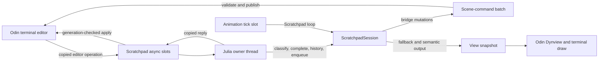
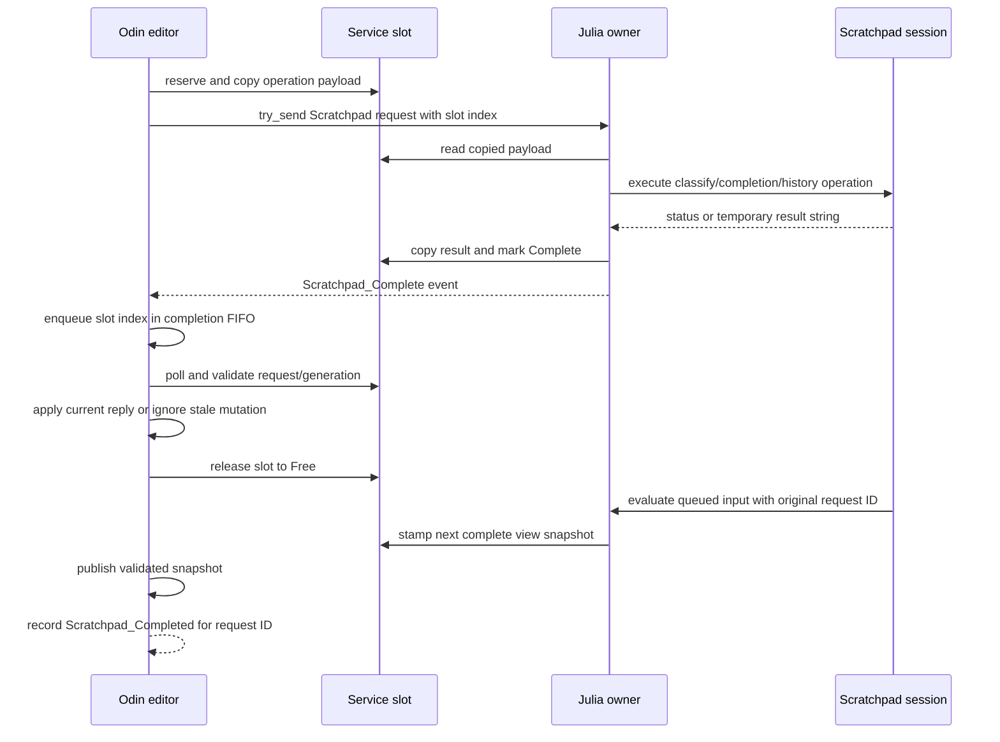
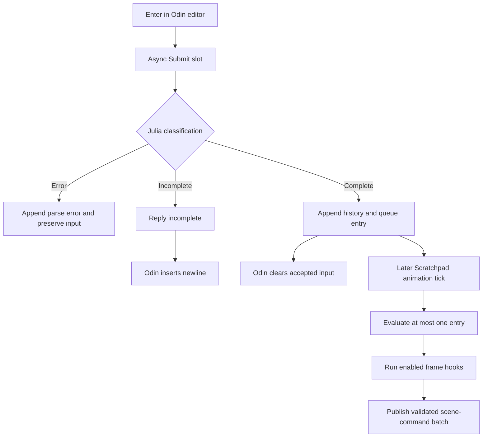

# Scratchpad Architecture

## Table Of Contents

1. [Purpose And Scope](#purpose-and-scope)
1. [Architectural Role](#architectural-role)
1. [Source Map](#source-map)
1. [Execution And Ownership Model](#execution-and-ownership-model)
1. [Lifecycle And Registration](#lifecycle-and-registration)
1. [Odin Editor And Terminal Surface](#odin-editor-and-terminal-surface)
1. [Scratchpad Communication Protocol](#scratchpad-communication-protocol)
1. [Submission And Evaluation Pipeline](#submission-and-evaluation-pipeline)
1. [Julia Session Model](#julia-session-model)
1. [Help Mode, Completion, And History](#help-mode-completion-and-history)
1. [Scene Mutation And Frame Hooks](#scene-mutation-and-frame-hooks)
1. [Output And Rendering Pipeline](#output-and-rendering-pipeline)
1. [Safety, Failure, And Backpressure](#safety-failure-and-backpressure)
1. [Reset And Reload Semantics](#reset-and-reload-semantics)
1. [Capacity And Retention Limits](#capacity-and-retention-limits)
1. [Verification Coverage](#verification-coverage)
1. [Change Guide](#change-guide)
1. [Correctness Invariants](#correctness-invariants)
1. [Current Constraints](#current-constraints)

## Purpose And Scope

Scratchpad is Euclid's interactive Julia environment. It appears as a root item
in the animation tree, but it combines a terminal editor, a persistent Julia
evaluation session, REPL completion and help, animation-frame callbacks, Euclid
drawing helpers, and the normal view/Dynview publication path.

This guide explains how those parts fit together across Odin and Julia. It
focuses on behavior unique to Scratchpad: copied editor requests, request and
input-generation correlation, parse-aware submission, delayed evaluation, and
mode-tagged history. The shared Julia owner-thread service, animation tick
publication, and view-snapshot machinery are described in
[JuliaThreadArchitecture.md](JuliaThreadArchitecture.md) and are referenced
here only where Scratchpad depends on them.

## Architectural Role

Scratchpad is both an animation and an interactive control surface:

- As an **animation**, it registers `get_view_text`, `initialize`, `loop`, and
  `clean` callbacks and receives fixed-step animation ticks.
- As a **terminal**, it has display-owned input, caret, prompt mode, scrolling,
  completion, and history-navigation state.
- As a **Julia session**, it owns an isolated runtime module, queued input,
  output records, history, frame hooks, and diagnostics.
- As a **scene author**, its evaluated code and frame hooks call the same bridge
  APIs used by content animations.

The important consequence is that pressing Enter does not evaluate code in the
UI handler. It starts a two-stage process:

1. An asynchronous Scratchpad operation classifies and queues a copied input.
1. A later Scratchpad animation tick evaluates one queued entry and captures
   scene mutations through the normal animation command batch.

This separation keeps Julia calls off the display thread and keeps interactive
scene changes inside the same validation and publication boundary as scripted
animation changes.

## Source Map

| Concern | Primary implementation |
| --- | --- |
| Shared slot, mode, service, and UI state types | `src/core/core.odin` |
| Copied requests and callback calls | `src/bridge/scratchpad.odin` |
| Request dispatch and completion FIFO | `src/bridge/runtime_service.odin` |
| Callback resolution and generation validation | `src/bridge/bootstrap.odin` |
| Selection/reload lifecycle integration | `src/bridge/animations.odin` |
| Terminal editor and reply application | `src/view/ui/scratchpad_panel.odin` |
| Text-panel routing | `src/view/ui/text_panel.odin` |
| Display-frame reply publication | `src/view/view.odin` |
| Julia registration and host-callable forwarding functions | `src/julia/script.jl` |
| Scratchpad Julia module composition | `src/julia/scratchpad.jl` |
| Session model, limits, and policy | `src/julia/scratchpad/model_state.jl` |
| Parsing and REPL completion | `src/julia/scratchpad/parsing_completion.jl` |
| History, hooks, queue, and export | `src/julia/scratchpad/hooks_history.jl` |
| Evaluation and animation callbacks | `src/julia/scratchpad/runtime_loop.jl` |
| Help, formatting, errors, and Dynview | `src/julia/scratchpad/presentation_help.jl` |
| REPL-oriented Euclid drawing jobs | `src/julia/euclidrepl.jl` |
| Julia behavioral tests | `src/julia/test/scratchpad_tests.jl` |
| Odin editor/protocol tests | `tests/view/ui_test.odin` |

## Execution And Ownership Model

Scratchpad spans the same display and Julia owner threads as other Julia-backed
features, but ownership remains sharply divided.

| State or operation | Owner | Notes |
| --- | --- | --- |
| Live input bytes, caret, prompt mode, and input generation | Display thread | Stored in `Euclid_UI_Runtime_State`. |
| Terminal scrolling, bottom pinning, and input drawing | Display thread | Raylib and UI work never moves to Julia. |
| Async request/reply slots | Runtime service | Fixed storage; display reserves/releases, owner fills replies. |
| Julia callback handles | Active interface generation | Resolved at startup/reload; owner-thread calls only. |
| Session, queue, history, output, hooks, metrics | Julia owner thread | Stored under `Scratchpad.session_ref`. |
| Canonical Euclid scene | Display thread | Scratchpad code does not mutate it concurrently. |
| Query snapshot and scene-command batch | Animation tick slot | Used during evaluation and hooks. |
| Published transcript and Dynview cache | Display side | Produced through the normal view-snapshot pipeline. |



No Scratchpad path grants the display thread permission to call Julia. Even
operations that feel synchronous to a terminal user are serialized through the
owner thread.

## Lifecycle And Registration

### Startup

`src/julia/script.jl` includes the Scratchpad and EuclidRepl modules, then
`init_euclid_scripts` registers Scratchpad as a root animation named
`"Scratchpad"`. Its stable animation ID is derived from the root name, so
selection can survive a successful interface reload.

Startup also calls `Scratchpad.prime_repl!`. Priming creates a temporary
session and exercises queueing, evaluation, backslash completion, generic
completion, view generation, and Dynview reset. This moves common Julia
compilation work out of the first interactive command. A fresh non-warmup
session is installed afterward.

On the Odin side, `prepare_julia_interface_generation` resolves all required
Scratchpad callbacks from `Main`. A generation is invalid unless classify,
completion, queue, history, and history-save handles all resolve. Scratchpad is
therefore part of runtime readiness, not an optional late-bound feature.

### Selection

Scratchpad uses the ordinary animation selection lifecycle:

1. Tree selection makes the Scratchpad animation current and selected.
1. Its `initialize` callback ensures a session and appends the Julia banner.
1. Fixed-step animation ticks call its `loop` callback while selected.
1. View requests call `get_view_text` and publish its transcript.
1. Leaving the animation calls `clean`, clears `session_ref`, and resets
   EuclidRepl's session state.

The Odin text panel checks the selected animation name. Only the Scratchpad
selection receives the live terminal editor; every other animation receives
the ordinary read-only view-text panel.

## Odin Editor And Terminal Surface

The editor lives in `Euclid_UI_Runtime_State` and uses fixed storage:

- a 4 KiB UTF-8 input buffer;
- byte length and byte-oriented caret position;
- a horizontal viewport start for the live input;
- `Julia` or `Help` input mode;
- a monotonically increasing input generation;
- pending submit and latest completion request IDs;
- a scenario-forced bottom-pin request ID;
- history-reset retry state;
- transcript length and bottom-pinning state.

`draw_scratchpad_output_and_prompt` presents transcript and live input as one
terminal-style scroll surface. The transcript comes from the latest published
view snapshot, while the live prompt and unsubmitted input stay entirely on
the display thread. This avoids rebuilding the Julia transcript for every
caret movement.

The editor increments `scratchpad_input_generation` whenever text or mode
changes. Asynchronous replies carry the generation captured at submission and
cannot edit a newer generation. This is the primary stale-editor defense.

The terminal remains pinned to its newest content until the user scrolls away
from the bottom. New output then preserves the user's reading position. A new
submit pins it again.

An accepted scenario submission additionally records its request ID as a
display-owned forced-bottom intent. Scroll input cannot unpin the transcript
until the matching asynchronous submit reply is applied. Applying that reply,
including a failed, incomplete, or stale-generation reply, clears the forced
intent while preserving ordinary bottom pinning so newly published response
content remains visible. Scenario requests do not reuse the interactive
editor's pending-submit identity.

## Scratchpad Communication Protocol

This section describes the Scratchpad-specific protocol layered on the generic
request/event service.

### Slot Storage

The runtime service owns 16 `Scratchpad_Async_Slot` values. Each slot contains:

- lifecycle state: `Free`, `Pending`, or `Complete`;
- operation kind, request ID, and runtime generation;
- input generation and input mode;
- host-state pointer and caret byte offset;
- inline 4 KiB input and 4 KiB result buffers;
- parse result and operation success flag.

The channel carries only a request record and slot index. Input is copied into
the slot before submission; result text is copied back before the owner thread
clears its temporary allocator. Neither side retains a temporary string across
the request boundary.

### Operations

| Kind | Input | Julia-side effect | Reply |
| --- | --- | --- | --- |
| `Submit` | text, mode, generation | Classify; queue only when complete | Parse status and success flag |
| `Complete` | text, caret byte, mode, generation | Query Julia REPL completion | `start\nend\nreplacement` |
| `History_Previous` | current mode, generation | Move history cursor backward | `mode\ntext` |
| `History_Next` | generation | Move history cursor forward | `mode\ntext` |
| `History_Reset` | generation | Move cursor after newest entry | Success flag |
| `Save_History` | path | Write retained input history | Success flag |

`scratchpad_complete_backslash` remains a resolved specialized callback used
by startup priming and direct bridge-level callers. The live editor uses the
generic `Complete` operation, whose Julia REPL completion machinery also
handles backslash substitutions.

### Request And Completion Flow



The owner thread executes requests serially, and completion slot indices enter
a bounded display-side FIFO in worker completion order. Polling drains generic
Julia events first, then returns completed Scratchpad slots from that FIFO.

### Reply Correlation Rules

Different operations require different correlation strength:

- Every editor-mutating result must match the current input generation.
- A submit result clears the pending-submit guard only when its request ID
  matches, even if its generation is stale. It may mutate input only when the
  generation also matches.
- A completion must match both the current generation and the latest
  completion request ID. Older Tab requests cannot replace newer results.
- History replies are applied in owner completion order and carry the original
  entry's prompt mode in the payload.
- History cursor reset has no visible reply, but edits mark it required and the
  display retries submission until bounded storage accepts it.

Submit is intentionally single-flight at the editor level. Completion and
history operations may coexist in the bounded service slots; generation checks
protect newer input from their delayed replies.

## Submission And Evaluation Pipeline

Submission has three distinct phases.

### 1. Editor Submission

Enter captures the current input bytes, prompt mode, and input generation. The
editor refuses another Enter while a submit request is pending. It does not
clear input optimistically.

### 2. Owner-Thread Classification And Queueing

The `Submit` operation calls `classify_input`:

- Help-mode input is always complete.
- A nonempty Julia-mode input beginning with `?` is treated as complete help
  syntax rather than parsed as ordinary Julia.
- Other Julia-mode input uses `Meta.parse(...; raise=false)` and returns parse
  error, incomplete, or complete.

Parse errors are appended to Julia-owned output and leave editor input intact.
Incomplete input causes Odin to insert a newline at the current caret so the
user can continue a multiline expression. Complete input is appended to
history and inserted into the bounded Julia execution queue; only then does
Odin clear the live editor.

### 3. Animation-Tick Evaluation

Queue insertion does not call `Core.eval`. During a later Scratchpad animation
tick, `loop` removes at most one queued entry, echoes it with its captured
prompt mode, evaluates it, and then runs enabled frame hooks.



Evaluation handles, in order:

1. prompt echo;
1. native Help-mode query;
1. `?target` help query or local command;
1. intercepted `exit`/`quit`;
1. Scratchpad safety policy;
1. defensive reclassification;
1. REPL soft-scope transformation and `Core.eval`;
1. result or exception formatting.

The expression is parsed with a `REPL[n]` filename so error stacks resemble a
native Julia REPL. Soft scope is applied when available, making loop/global
behavior closer to interactive Julia than file evaluation.

## Julia Session Model

`ScratchpadSession` is the Julia-owned aggregate for one interactive lifetime.
It contains:

- a unique numeric session ID;
- a fresh Julia `Module` used as evaluation scope;
- mode-tagged execution queue and history entries;
- plain output lines plus structured output records;
- registered frame hooks;
- metrics and history cursor state.

### Isolated Runtime Module

Each reset creates `EuclidScratchpadSession_<id>`. The module receives stable
bindings to `OdinJuliaBridge`, `EuclidLatex`, `EuclidGeometry`,
`EuclidAnimations`, `EuclidRepl`, `Scratchpad`, `LaTeXStrings`, and `Latexify`.
It also exposes convenience functions that capture the current `state_ptr`:

- hook registration and removal;
- history saving;
- point, line, circle, pen, compass, and transform helpers;
- `hide!` and color discovery;
- intercepted `exit` and `quit`.

Definitions entered by the user persist in this module until the session is
reset or cleaned. A fresh module isolates ordinary bindings from the previous
session, although imported process-wide Julia modules remain shared.

### Local Commands

Local commands are handled before general evaluation:

| Command | Effect |
| --- | --- |
| `:help` | Append Scratchpad command and helper summary. |
| `:clear` | Clear retained transcript output. |
| `:hooks` | List frame hooks and failure state. |
| `:stats` | Append queue, retention, error, timing, and lifecycle metrics. |
| `:reset` | Replace the current session and runtime module. |

A lone `?` aliases `:help`. Calls to `exit`, `quit`, `exit()`, or `quit()` do
not terminate the embedded Julia process; they reset only the Scratchpad
session.

## Help Mode, Completion, And History

### Prompt Mode

Odin owns the live mode transition because prompt behavior is immediate UI
state:

- typing `?` as the first character at caret zero removes that character and
  enters Help mode;
- pasting `?` does not trigger this editor transition;
- Backspace on an empty Help input returns to Julia mode;
- the prompt token is `julia>` in Julia mode and `help?>` in Help mode.

Mode is copied into every relevant async operation and stored with queued and
history entries. Delayed work therefore does not infer mode from whatever
prompt is visible when it eventually runs.

Help-mode evaluation delegates to Julia's native `REPL.helpmode`. Julia-mode
`?target` syntax also supports documentation lookup, including aliases for
Scratchpad and EuclidRepl helpers.

### Completion

Tab sends full input and a caret byte offset to
`REPL.REPLCompletions.completions` in the active session module. One candidate
replaces the completion range directly. Multiple candidates replace only when
they extend the current text with a longer common prefix.

The reply is a compact text payload containing zero-based Odin byte offsets:

```text
start_byte\nend_byte\nreplacement
```

Odin validates separators, nonnegative offsets, current input bounds, request
ID, and generation before replacing the byte range. A successful replacement
increments the input generation.

### History

Julia owns retained history and its cursor. Every accepted input records both
text and mode. History replies encode:

```text
mode_integer\ntext
```

Odin restores the mode and text together. When navigation advances beyond the
newest entry, Julia returns an empty string tagged with the mode that was
active when backward navigation began.

Any direct edit requests a cursor reset to the newest position. Because this
reset preserves editor semantics after saturation, Odin retains a pending bit
and retries until the service accepts it.

History export writes retained input text one entry per line. Prompt mode is
not serialized to the file.

## Scene Mutation And Frame Hooks

Scratchpad evaluation occurs inside its animation `loop`, so bridge calls made
by evaluated code see the current animation query snapshot and scene-command
batch. They do not directly race the display-owned canonical scene.

At the fixed-step publication boundary:

1. the owner thread evaluates one queued input;
1. evaluated Euclid helpers capture bridge commands;
1. enabled frame hooks run and capture additional commands;
1. the completed batch is returned with the animation tick;
1. Odin rejects stale or invalid batches and otherwise applies the whole batch;
1. constraints run before rendering or capture observes the scene.

Frame hooks provide persistent per-tick behavior. Each hook has an ID, label,
enabled flag, total failures, and consecutive-failure count. A successful call
resets its consecutive failures. Three consecutive failures disable the hook
and append a user-visible message.

`EuclidRepl` uses a silent frame hook to advance its active drawing job. Starting
a new job finalizes and replaces the previous one. Scratchpad session resets
also reset EuclidRepl's active job state so a callback does not survive the
session that created it.

## Output And Rendering Pipeline

Julia stores output in two synchronized forms:

- `output`, a vector of complete plain lines used as fallback text;
- `output_entries`, structured records containing block kind, style, optional
  color segments, and optional LaTeX source.

Inputs are echoed as prompt-styled input blocks. Ordinary results use Julia's
`text/plain` display. When a result also supports `text/latex`, Scratchpad keeps
the plain representation for fallback/copy and emits the LaTeX expression as a
Dynview math block.

Exceptions use Julia's native REPL error formatter. Scratchpad scrubs host eval
frames, bounds the formatted text, parses the supported ANSI SGR styles into
Dynview text segments, and never sends raw terminal escape sequences to Odin.

`get_view_text` rebuilds a Scratchpad Dynview stream from structured entries
and returns joined plain output. The generic view-snapshot pipeline copies both
forms into service-owned storage, validates the complete stream, and publishes
it at a display-frame boundary. Odin then compiles/layouts the stream and draws
it above the live display-owned prompt. Invalid semantic output falls back to
the complete plain transcript.

The resulting path is deliberately separate from the async editor protocol:

```text
editor request -> Scratchpad slot -> Julia session mutation
Julia output -> view snapshot -> Odin Dynview/fallback transcript
```

A successful submit reply can therefore clear the editor before its echoed
input or result appears; transcript visibility waits for evaluation and a
subsequent view snapshot.

`Scratchpad_Completed` is deliberately later than the async slot reply. Julia
retains the original runtime request ID in the bounded queue and reports it only
after evaluation finishes. Odin carries that watermark through the next complete
view snapshot and records the required presentation event only after valid display
publication. Stale runtime generations, rejected snapshots, reload, and shutdown
cannot produce completion evidence. Scenario waits may correlate this event to the
alias returned by the originating `scratchpad` action.

## Safety, Failure, And Backpressure

### Input Policy

Before general evaluation, Scratchpad blocks selected high-risk forms including
package management, `ccall`/`@ccall`, process execution, downloads, and common
file mutation calls. Blocked input is echoed and receives a user-visible policy
message.

This is a convenience safety policy, not a security sandbox. It is token-based,
runs inside the host process, and exposes powerful Euclid and Julia modules.
Scratchpad input must still be treated as trusted local code.

### Errors

- Parse errors are appended to output and preserve live input.
- Evaluation errors increment metrics and become bounded native-style output.
- Hook errors are isolated per hook; repeated failures auto-disable that hook.
- Julia callback exceptions are logged at the Odin bridge and converted to
  operation failure or empty result.
- Dynview emission failures preserve the plain transcript fallback.
- History-save errors append a user-visible Julia error line.

Slow evals and hooks over 250 ms increment metrics and log console warnings.
They do not append transcript warnings or interrupt execution.

### Saturation

Slot reservation and request-channel insertion are nonblocking. A new optional
completion or history request may be rejected when no slot or channel capacity
is available. A submit that is not accepted remains visible in the editor and
has no pending-submit ID. Required history reset is explicitly retried.

The Julia execution queue has a different overflow policy: once full, adding a
new entry drops the oldest queued entry and increments `queue_dropped`. This
keeps the most recent accepted work but means successful editor submission does
not guarantee eventual evaluation under sustained overload.

## Reset And Reload Semantics

Several operations called “reset” affect different ownership domains.

Scratchpad remains a stable bootstrapped service and is intentionally outside the
anonymous content-generation migration. Runtime generations own the metadata catalog
and path-backed animation implementations; they do not own Scratchpad's module, session,
history, completion, or evaluation state. Reload still registers the eager Scratchpad
entry into the candidate Odin interface and applies the lifecycle reset below. Moving
Scratchpad itself under generation ownership is a separate design task.

| Trigger | Odin editor | Julia Scratchpad session | EuclidRepl state | Julia process |
| --- | --- | --- | --- | --- |
| Select tree node | Clear input; Julia mode; reset scroll | Lifecycle decides | Lifecycle decides | Preserved |
| `:clear` | Preserved | Clear output only | Preserved | Preserved |
| `:reset` | Submit completes | Fresh module and session state | Reset | Preserved |
| `exit`/`quit` | Current submit completes normally | Fresh session with reset message | Reset | Preserved |
| Leave Scratchpad | Cleared by tree selection | `clean` drops session | Reset | Preserved |
| Return to Scratchpad | Empty Julia-mode editor | `initialize` ensures session/banner | Lazy fresh state | Preserved |
| Reload succeeds | Clear input; Julia mode; pin bottom | New lifecycle initializes | Reset by clean | Preserved |
| App shutdown | Destroyed with host | Discarded during teardown | Discarded | Owner-thread shutdown |

Tree selection and reload reset the visible Odin editor independently of Julia
session creation. Session reset commands replace Julia-owned state but do not
directly mutate the editor because they execute after that input has already
been accepted and cleared.

## Capacity And Retention Limits

| Resource | Limit | Overflow behavior |
| --- | ---: | --- |
| Odin live editor input | 4 KiB | Input widget cannot exceed fixed buffer. |
| Async Scratchpad slots | 16 | New operation rejected. |
| Async slot input/result | 4 KiB each | Oversize input rejected; result truncated to slot capacity. |
| Julia execution queue | 64 entries | Oldest queued entry dropped. |
| Julia history | 400 entries | Oldest history entries trimmed. |
| Julia output | 400 lines | Oldest output and structured entries trimmed together. |
| Formatted exception output | 16 KiB | UTF-8-safe truncation marker appended. |
| Consecutive hook failures | 3 | Hook disabled. |
| Slow eval/hook threshold | 250 ms | Metric and console warning only. |

The Julia vectors are bounded by retention policy but may allocate within the
Julia GC heap. Host-side request storage is fixed and reused.

## Verification Coverage

Julia tests exercise:

- complete, incomplete, and erroneous parsing;
- isolated session creation and persistent eval scope;
- Help mode, helper documentation, and local commands;
- backslash and generic completion;
- native exception formatting and ANSI-to-Dynview conversion;
- plain and LaTeX result formatting;
- mode-tagged history navigation;
- queue, history, and output retention behavior;
- safety-policy rejection, metrics, hooks, resets, and lifecycle callbacks;
- Dynview stream emission and fallback behavior.

Odin tests exercise:

- prompt-mode transitions and paste behavior;
- completion and history wire-format decoding;
- stale-generation submit preservation;
- newest-request completion correlation;
- incomplete-submit newline insertion;
- terminal geometry, UTF-8 caret behavior, scrolling, and style integration.

The complete repository verification gate is:

```sh
cmake --preset default
cmake --build --preset default --target check
```

This runs the validated build, repository analysis, and all tests.

## Change Guide

### Add An Editor Operation

1. Add the operation to `Scratchpad_Async_Kind` and any required fixed slot
   fields in `src/core/core.odin`.
1. Populate copied input in `try_submit_scratchpad_async`.
1. Dispatch it in `scratchpad_async_task` on the Julia owner thread.
1. Add or reuse a resolved Julia callback symmetrically in bootstrap and
   `src/julia/script.jl`.
1. Define the result encoding and validate it before Odin mutates editor state.
1. Choose explicit request-ID, generation, retry, and saturation semantics.
1. Add Julia behavior tests and Odin protocol/stale-reply tests.

### Add A Scratchpad Command Or Helper

1. Put session behavior in the owning Julia Scratchpad module.
1. Expose user-callable helpers in `create_runtime_module` when they need direct
   names in session scope.
1. Add documentation aliases when native help should find a wrapped helper.
1. Decide whether the operation is immediate Julia state, queued eval, a frame
   hook, or a scene mutation; do not bypass the matching owner boundary.
1. Update `:help` output and tests when the user-facing command set changes.

### Change Output Presentation

Preserve both `output` and `output_entries`, including one-to-one trimming.
Plain output is the fallback and copy contract; structured output is an
enhancement. A new structured record must fail closed without deleting its
plain meaning.

## Correctness Invariants

- Only the Julia owner thread calls Scratchpad Julia callbacks or mutates a
  `ScratchpadSession`.
- The display thread owns live editor and rendering state.
- Async payload strings are copied into fixed service slots before submission
  and before worker temporary memory is reset.
- Every consumed slot returns to `Free`, including stale replies.
- No reply mutates input from a different input generation.
- Completion additionally requires the latest completion request ID.
- Prompt mode travels with async input, queue entries, and history entries.
- Enter classifies and queues; actual evaluation occurs only in Scratchpad
  animation `loop`.
- Interactive scene changes use animation query snapshots and transactional
  command batches.
- Output and structured output entries are retained and trimmed together.
- Plain transcript content remains sufficient when Dynview output is invalid.
- Resetting Scratchpad never shuts down the embedded Julia runtime.

## Current Constraints

- Scratchpad is trusted in-process code, not a secure sandbox.
- One queued input is evaluated per Scratchpad animation tick. Slow eval blocks
  the Julia owner thread, although display rendering continues with old state.
- All frame hooks run serially after evaluation; one slow hook delays later
  Julia requests and hooks.
- Queue overflow drops the oldest accepted but unevaluated command.
- Async result payloads use compact newline-delimited encodings rather than a
  typed cross-language result structure.
- History export does not preserve Julia/Help mode or multiline entry framing;
  it writes raw entry text followed by a newline.
- Tree-selection and reload editor resets clear visible input without
  incrementing `scratchpad_input_generation`. The serialized owner-thread
  ordering usually drains earlier work first, but future changes to request
  concurrency or reload ordering must explicitly invalidate old editor replies.
- Julia session isolation is namespace isolation, not process isolation; code
  can still affect shared modules and host resources made reachable in scope.
